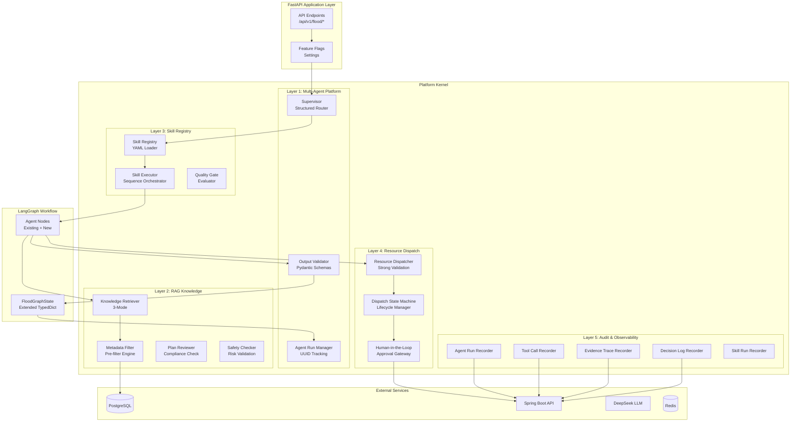
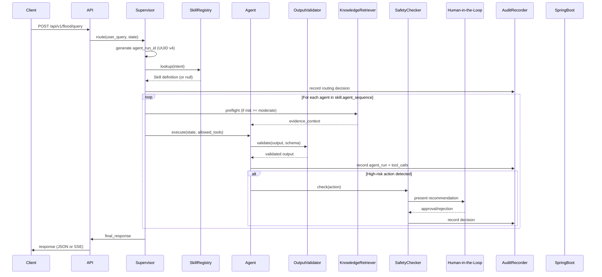

# Design Document — 防汛智能体平台内核 (Flood Agent Platform Kernel)

## Overview

本设计文档描述将现有 LangGraph 多智能体防汛系统升级为产品化平台内核的技术方案。升级采用增量式架构，通过五个可独立开关的层次实现：

1. **多智能体平台层** — 结构化输出、Supervisor 路由决策增强、Agent 通信约束
2. **RAG 知识层** — 三模式检索（问答/预案前置/决策校验）、领域元数据扩展
3. **技能注册层** — 声明式 YAML Skill 定义、意图驱动的工作流编排
4. **资源调度强化层** — 强约束验证、状态机生命周期、人机协同审批
5. **审计与可观测层** — 全链路追踪、决策日志、证据溯源

### Design Decisions

| 决策 | 选择 | 理由 |
|------|------|------|
| 结构化输出方案 | Pydantic BaseModel + LLM structured output | 利用现有 Pydantic 生态，支持 JSON Schema 导出，与 LangGraph 状态管理无缝集成 |
| Skill 定义格式 | YAML + JSON Schema 校验 | 声明式、人类可读、支持版本控制，无需代码变更即可新增工作流 |
| 状态机实现 | Python `transitions` 库 | 轻量级、声明式状态定义、支持回调和守卫条件 |
| 审计存储 | PostgreSQL 表 (通过 Spring Boot API 写入) | 保持现有数据流模式一致性，利用 Flyway 迁移管理 |
| 特性开关 | 环境变量 + Settings dataclass | 与现有配置模式一致，支持容器化部署的灵活切换 |
| RAG 元数据过滤 | SQL WHERE 前置 + 向量相似度 | 先缩小候选集再做语义匹配，提升检索精度和性能 |

## Architecture

### High-Level Architecture



### Request Flow (with all layers enabled)



## Components and Interfaces

### Layer 1: Multi-Agent Platform

#### 1.1 Structured Routing Decision (Supervisor Enhancement)

**File:** `app/agents/supervisor.py` (修改)

```python
from pydantic import BaseModel, Field
from enum import Enum
import uuid

class SafetyLevel(str, Enum):
    NORMAL = "normal"
    ELEVATED = "elevated"
    HIGH = "high"
    CRITICAL = "critical"

class RoutingDecision(BaseModel):
    """Supervisor 结构化路由决策输出"""
    agent_run_id: str = Field(default_factory=lambda: str(uuid.uuid4()))
    intent: str
    next_agent: str
    required_context: list[str] = Field(default_factory=list)
    missing_context: list[str] = Field(default_factory=list)
    reasoning: str
    safety_level: SafetyLevel = SafetyLevel.NORMAL
    human_confirmation_required: bool = False

    def model_post_init(self, __context):
        if self.safety_level in (SafetyLevel.HIGH, SafetyLevel.CRITICAL):
            self.human_confirmation_required = True
```

**Integration:** The existing `supervisor_node` function is extended to produce a `RoutingDecision` object. When `structured_output_enabled` is False, the existing dict-based output is preserved.

#### 1.2 Agent Output Schemas

**File:** `app/schemas/agent_outputs.py` (新增)

```python
from pydantic import BaseModel, Field
from app.state import RiskLevel

class RiskAssessorOutput(BaseModel):
    risk_level: RiskLevel
    risk_score: float = Field(ge=0.0, le=1.0)
    affected_stations: list[str]
    response_level: str
    reasoning: str
    citations: list[dict] = Field(default_factory=list)

class PlanGeneratorOutput(BaseModel):
    actions: list[dict]
    resources: list[dict]
    notifications: list[dict]
    trigger_conditions: str
    citations: list[dict] = Field(default_factory=list)

class ResourceDispatcherOutput(BaseModel):
    resource_plan: list[ResourceAllocationOutput]
    dispatch_id: str | None = None

class ResourceAllocationOutput(BaseModel):
    resource_id: str
    quantity: int = Field(gt=0)
    status: str
    source_location: str
    target_location: str

class ExecutionMonitorOutput(BaseModel):
    progress_pct: float = Field(ge=0.0, le=100.0)
    blocked_actions: list[dict] = Field(default_factory=list)
    recommendations: list[str] = Field(default_factory=list)
```

#### 1.3 Output Validator

**File:** `app/platform/output_validator.py` (新增)

```python
from pydantic import ValidationError
from typing import Any

class OutputValidationResult:
    valid: bool
    validated_output: Any | None
    raw_output: Any
    errors: list[str]

async def validate_agent_output(
    agent_name: str,
    raw_output: dict,
    schema_registry: dict[str, type[BaseModel]],
) -> OutputValidationResult:
    """Validate agent output against registered schema.
    
    On failure: logs error, attaches raw output to agent_run, returns graceful degradation.
    """
```

### Layer 2: RAG Knowledge

#### 2.1 Three-Mode Knowledge Retriever

**File:** `app/agents/knowledge_retriever.py` (修改)

The existing knowledge retriever already supports `answer` and `preflight_*` modes. The upgrade adds:
- **Validation mode** (`rag_target="validation"`): retrieves regulatory documents for Plan_Reviewer
- **Metadata-filtered retrieval**: passes structured filters to the search layer

```python
class RetrievalMode(str, Enum):
    ANSWER = "answer"
    PREFLIGHT_PLAN = "preflight_plan"
    PREFLIGHT_RISK = "preflight_risk"
    VALIDATION = "validation"

class MetadataFilter(BaseModel):
    doc_type: str | None = None  # regulation, manual, sop, template, case_study
    region_code: str | None = None
    basin_code: str | None = None
    station_id: str | None = None
    effective_date: date | None = None
    expire_date: date | None = None
    authority_level: str | None = None  # national, provincial, municipal, district
    risk_level_applicable: str | None = None
```

#### 2.2 Metadata-Filtered Retrieval

**File:** `app/rag/retriever.py` (修改)

```python
async def hybrid_search(
    query: str,
    *,
    top_k: int = 5,
    source_types: list[str] | None = None,
    metadata_filter: MetadataFilter | None = None,  # NEW
) -> list[SearchResult]:
    """Extended to apply metadata pre-filter before vector similarity."""
```

The SQL query is extended with WHERE clauses for metadata fields before the vector similarity computation. Expired documents (expire_date < today) are excluded by default.

#### 2.3 Plan_Reviewer Agent

**File:** `app/agents/plan_reviewer.py` (新增)

```python
class ComplianceResult(BaseModel):
    compliant: bool
    violations: list[ViolationDetail] = Field(default_factory=list)
    suggestions: list[str] = Field(default_factory=list)
    cited_regulations: list[dict] = Field(default_factory=list)

class ViolationDetail(BaseModel):
    rule_id: str
    description: str
    severity: str  # warning, error, critical
    cited_source: str

async def plan_reviewer_node(state: dict) -> dict:
    """Validates generated plan against regulatory evidence."""
```

#### 2.4 Safety_Checker Agent

**File:** `app/agents/safety_checker.py` (新增)

```python
class SafetyCheckResult(BaseModel):
    safe_to_proceed: bool
    risk_factors: list[str] = Field(default_factory=list)
    required_approvals: list[str] = Field(default_factory=list)
    reasoning: str = ""

HIGH_RISK_ACTIONS = {
    "evacuation", "road_closure", "service_suspension",
    "dispatch_approval", "external_notification", "level_escalation",
}

async def safety_checker_node(state: dict) -> dict:
    """Verifies high-risk actions against safety constraints."""
```

### Layer 3: Skill Registry

#### 3.1 Skill Definition Schema

**File:** `app/skills/schema.py` (新增)

```python
from pydantic import BaseModel, Field

class QualityGate(BaseModel):
    name: str
    check_type: str  # field_present, threshold, regex, custom
    target_field: str
    condition: str
    threshold: float | None = None

class SkillDefinition(BaseModel):
    id: str
    name: str
    version: str
    trigger_intents: list[str]
    required_inputs: list[str]
    required_tools: list[str]
    agent_sequence: list[str]
    output_schema: str  # reference to Pydantic model name
    quality_gates: list[QualityGate] = Field(default_factory=list)
    fallback_strategy: str = "degrade"  # retry, degrade, escalate_to_human
```

**Example Skill YAML** (`app/skills/risk_assessment.yaml`):

```yaml
id: risk_assessment
name: 风险研判
version: "1.0"
trigger_intents:
  - risk_assessment
  - alarm_overview
required_inputs:
  - user_query
  - session_id
required_tools:
  - query_station_data
  - query_observations
  - query_alarms
  - query_weather
agent_sequence:
  - data_analyst
  - risk_assessor
output_schema: RiskAssessorOutput
quality_gates:
  - name: risk_score_present
    check_type: field_present
    target_field: risk_assessment.risk_score
    condition: "is_not_none"
  - name: affected_stations_populated
    check_type: threshold
    target_field: risk_assessment.affected_stations
    condition: "len >= 0"
    threshold: 0
fallback_strategy: degrade
```

#### 3.2 Skill Registry Service

**File:** `app/platform/skill_registry.py` (新增)

```python
class SkillRegistry:
    """Loads, validates, and indexes Skill definitions from YAML files."""
    
    def __init__(self, skills_dir: str = "app/skills/"):
        self._skills: dict[str, SkillDefinition] = {}
        self._intent_index: dict[str, SkillDefinition] = {}
    
    def load_all(self) -> None:
        """Load all YAML files from skills directory, validate, index."""
    
    def lookup_by_intent(self, intent: str) -> SkillDefinition | None:
        """Return matching skill or None."""
    
    def get_skill(self, skill_id: str) -> SkillDefinition | None:
        """Return skill by ID."""
```

#### 3.3 Skill Executor

**File:** `app/platform/skill_executor.py` (新增)

```python
class SkillExecutor:
    """Orchestrates agent execution according to a Skill's agent_sequence."""
    
    async def execute(
        self,
        skill: SkillDefinition,
        state: FloodGraphState,
        agent_registry: dict[str, Callable],
    ) -> tuple[FloodGraphState, SkillRunResult]:
        """Execute skill sequence, enforce tool constraints, evaluate quality gates."""
    
    def evaluate_quality_gates(
        self,
        skill: SkillDefinition,
        state: FloodGraphState,
    ) -> list[QualityGateResult]:
        """Evaluate all quality gates and return results."""
```

### Layer 4: Resource Dispatch Hardening

#### 4.1 Dispatch Validator

**File:** `app/platform/dispatch_validator.py` (新增)

```python
class ValidationFailure(BaseModel):
    resource_id: str
    rule: str  # existence, quantity, status, location
    message: str

class DispatchValidationResult(BaseModel):
    valid_allocations: list[ResourceAllocationOutput]
    rejected_allocations: list[ValidationFailure]

async def validate_dispatch_plan(
    allocations: list[dict],
    inventory_service: InventoryService,
) -> DispatchValidationResult:
    """Validate each allocation against inventory constraints.
    
    Rules:
    1. resource_id must exist in inventory
    2. quantity <= available quantity
    3. resource status must be "available"
    4. target_location must be recognized
    
    Partial success: valid allocations proceed, invalid ones are rejected with reasons.
    """
```

#### 4.2 Dispatch State Machine

**File:** `app/platform/dispatch_state_machine.py` (新增)

```python
from enum import Enum

class DispatchState(str, Enum):
    AI_DRAFT = "AI_DRAFT"
    APPROVED = "APPROVED"
    DISPATCHED = "DISPATCHED"
    ARRIVED = "ARRIVED"
    RETURNED = "RETURNED"
    CANCELLED = "CANCELLED"

VALID_TRANSITIONS: dict[DispatchState, set[DispatchState]] = {
    DispatchState.AI_DRAFT: {DispatchState.APPROVED, DispatchState.CANCELLED},
    DispatchState.APPROVED: {DispatchState.DISPATCHED, DispatchState.CANCELLED},
    DispatchState.DISPATCHED: {DispatchState.ARRIVED, DispatchState.CANCELLED},
    DispatchState.ARRIVED: {DispatchState.RETURNED},
}

class TransitionRecord(BaseModel):
    from_state: DispatchState
    to_state: DispatchState
    timestamp: datetime
    operator_id: str
    reason: str

class DispatchStateMachine:
    """Manages dispatch order lifecycle with strict transition enforcement."""
    
    def __init__(self, current_state: DispatchState = DispatchState.AI_DRAFT):
        self._state = current_state
        self._history: list[TransitionRecord] = []
    
    @property
    def state(self) -> DispatchState:
        return self._state
    
    def can_transition(self, target: DispatchState) -> bool:
        allowed = VALID_TRANSITIONS.get(self._state, set())
        return target in allowed
    
    def transition(
        self, target: DispatchState, operator_id: str, reason: str
    ) -> TransitionRecord:
        if not self.can_transition(target):
            raise InvalidTransitionError(
                current=self._state, target=target
            )
        record = TransitionRecord(
            from_state=self._state,
            to_state=target,
            timestamp=datetime.utcnow(),
            operator_id=operator_id,
            reason=reason,
        )
        self._state = target
        self._history.append(record)
        return record
```

#### 4.3 Human-in-the-Loop Gateway

**File:** `app/platform/human_in_the_loop.py` (新增)

```python
class PendingApproval(BaseModel):
    id: str  # UUID
    action_type: str
    action_payload: dict
    evidence: list[dict]
    safety_check_result: SafetyCheckResult | None
    created_at: datetime
    timeout_minutes: int = 30
    status: str = "pending"  # pending, approved, rejected, escalated

class ApprovalDecision(BaseModel):
    approved: bool
    approver_id: str
    reason: str
    timestamp: datetime

HIGH_RISK_ACTION_TYPES = {
    "dispatch_approval",      # AI_DRAFT → APPROVED
    "external_notification",  # 发送外部通知
    "level_escalation",       # 响应等级提升
    "evacuation",             # 疏散指令
    "road_closure",           # 道路封闭
    "service_suspension",     # 服务暂停
}

class HumanInTheLoopGateway:
    """Manages human approval workflow for high-risk actions."""
    
    async def submit_for_approval(self, action: PendingApproval) -> str:
        """Store pending action, return approval_id."""
    
    async def approve(self, approval_id: str, decision: ApprovalDecision) -> None:
        """Record approval and allow action execution."""
    
    async def reject(self, approval_id: str, decision: ApprovalDecision) -> None:
        """Record rejection with reason."""
    
    async def check_timeout(self, approval_id: str) -> bool:
        """Check if timeout exceeded, escalate if needed."""
```

### Layer 5: Audit & Observability

#### 5.1 Audit Recorder

**File:** `app/platform/audit_recorder.py` (新增)

```python
class AuditRecorder:
    """Records all execution artifacts to audit tables via Spring Boot API."""
    
    def __init__(self, platform_client: PlatformClient, enabled: bool = True):
        self._client = platform_client
        self._enabled = enabled
    
    async def record_agent_run(self, run: AgentRunRecord) -> None:
        """Write to ai_agent_run table."""
    
    async def record_tool_call(self, call: ToolCallRecord) -> None:
        """Write to ai_tool_call table."""
    
    async def record_evidence_trace(self, trace: EvidenceTraceRecord) -> None:
        """Write to ai_evidence_trace table."""
    
    async def record_decision(self, decision: DecisionLogRecord) -> None:
        """Write to ai_decision_log table."""
    
    async def record_skill_run(self, run: SkillRunRecord) -> None:
        """Write to ai_skill_run table."""
```

### Feature Flag Integration

**File:** `app/config.py` (修改)

```python
@dataclass
class Settings:
    # ... existing fields ...
    
    # Platform Kernel Feature Flags (all disabled by default)
    structured_output_enabled: bool = False
    skill_registry_enabled: bool = False
    dispatch_state_machine_enabled: bool = False
    audit_tables_enabled: bool = False
    plan_reviewer_enabled: bool = False
```

## Data Models

### Extended FloodGraphState (Additive Only)

```python
class FloodGraphState(TypedDict, total=False):
    # === Existing fields (unchanged) ===
    session_id: str
    user_id: str
    username: str
    user_query: str
    messages: Annotated[list[dict], operator.add]
    iteration: int
    current_agent: str
    next_agent: str
    intent: str
    supervisor_reasoning: str
    focus_station_query: str
    focus_station: dict
    answer_policy: dict
    data_summary: str
    overview_data: dict
    weather_forecast: dict
    risk_assessment: RiskAssessment
    emergency_plan: EmergencyPlan
    resource_plan: list[ResourceAllocation]
    notifications: list[NotificationRecord]
    evidence: list[Evidence]
    evidence_context: list[Evidence]
    execution_progress: ExecutionProgress
    memory_context: dict
    memory_write_result: dict
    rag_target: str
    rag_call_count: int
    rag_query_cache: dict
    rag_skip_reasons: list[str]
    final_response: str
    final_response_draft: str
    execution_traces: Annotated[list[dict], operator.add]
    error: str

    # === New fields (additive) ===
    agent_run_id: str                          # UUID v4 per routing decision
    routing_decision: dict                     # Structured routing decision
    safety_level: str                          # normal/elevated/high/critical
    human_confirmation_required: bool          # True when safety_level >= high
    active_skill_id: str | None               # Currently executing skill
    skill_agent_sequence: list[str]           # Remaining agents in skill
    skill_quality_results: list[dict]         # Quality gate results
    compliance_result: dict | None            # Plan_Reviewer output
    safety_check_result: dict | None          # Safety_Checker output
    pending_approvals: list[dict]             # Actions awaiting human approval
    dispatch_orders: list[dict]               # Dispatch orders with state machine
    metadata_filter: dict | None              # RAG metadata filter context
```

### Audit Database Tables

#### ai_agent_run

| Column | Type | Description |
|--------|------|-------------|
| id | UUID (PK) | 记录主键 |
| session_id | VARCHAR(64) | 会话 ID |
| agent_run_id | UUID | Agent 执行唯一标识 |
| agent_name | VARCHAR(64) | Agent 名称 |
| input_state_json | JSONB | 输入状态快照 |
| output_state_json | JSONB | 输出状态快照 |
| status | VARCHAR(16) | started / completed / failed |
| started_at | TIMESTAMP | 开始时间 |
| finished_at | TIMESTAMP | 结束时间 |
| error_message | TEXT | 错误信息 (nullable) |

#### ai_tool_call

| Column | Type | Description |
|--------|------|-------------|
| id | UUID (PK) | 记录主键 |
| agent_run_id | UUID (FK) | 关联 Agent 执行 |
| tool_name | VARCHAR(128) | 工具名称 |
| input_json | JSONB | 工具输入参数 |
| output_json | JSONB | 工具输出结果 |
| success | BOOLEAN | 是否成功 |
| latency_ms | INTEGER | 执行耗时 (毫秒) |
| error_message | TEXT | 错误信息 (nullable) |

#### ai_evidence_trace

| Column | Type | Description |
|--------|------|-------------|
| id | UUID (PK) | 记录主键 |
| session_id | VARCHAR(64) | 会话 ID |
| citation_id | VARCHAR(64) | 引用标识 |
| document_id | UUID | 文档 ID |
| chunk_id | UUID | 文档片段 ID |
| score | FLOAT | 相关性评分 |
| used_by_agent | VARCHAR(64) | 使用该证据的 Agent |
| used_in_field | VARCHAR(128) | 证据被用于的输出字段 |

#### ai_decision_log

| Column | Type | Description |
|--------|------|-------------|
| id | UUID (PK) | 记录主键 |
| session_id | VARCHAR(64) | 会话 ID |
| decision_type | VARCHAR(64) | routing / dispatch / notification / escalation |
| decision_json | JSONB | 决策内容 |
| evidence_ids | UUID[] | 关联证据 ID 列表 |
| human_approved | BOOLEAN | 是否经人工审批 (nullable) |
| approved_by | VARCHAR(64) | 审批人 ID (nullable) |
| approved_at | TIMESTAMP | 审批时间 (nullable) |

#### ai_skill_run

| Column | Type | Description |
|--------|------|-------------|
| id | UUID (PK) | 记录主键 |
| skill_id | VARCHAR(64) | 技能 ID |
| skill_version | VARCHAR(16) | 技能版本 |
| session_id | VARCHAR(64) | 会话 ID |
| agent_run_id | UUID | 关联 Agent 执行 |
| input_json | JSONB | 技能输入 |
| output_json | JSONB | 技能输出 |
| quality_check_result | JSONB | 质量门检查结果 |

### Knowledge Document Metadata Extension

```sql
ALTER TABLE kb_document ADD COLUMN IF NOT EXISTS doc_type VARCHAR(32);
ALTER TABLE kb_document ADD COLUMN IF NOT EXISTS region_code VARCHAR(16);
ALTER TABLE kb_document ADD COLUMN IF NOT EXISTS basin_code VARCHAR(16);
ALTER TABLE kb_document ADD COLUMN IF NOT EXISTS station_id VARCHAR(64);
ALTER TABLE kb_document ADD COLUMN IF NOT EXISTS effective_date DATE;
ALTER TABLE kb_document ADD COLUMN IF NOT EXISTS expire_date DATE;
ALTER TABLE kb_document ADD COLUMN IF NOT EXISTS authority_level VARCHAR(16);
ALTER TABLE kb_document ADD COLUMN IF NOT EXISTS risk_level_applicable VARCHAR(16);

-- Propagate to chunk level for efficient filtering
ALTER TABLE kb_chunk ADD COLUMN IF NOT EXISTS doc_type VARCHAR(32);
ALTER TABLE kb_chunk ADD COLUMN IF NOT EXISTS region_code VARCHAR(16);
ALTER TABLE kb_chunk ADD COLUMN IF NOT EXISTS basin_code VARCHAR(16);
ALTER TABLE kb_chunk ADD COLUMN IF NOT EXISTS expire_date DATE;
ALTER TABLE kb_chunk ADD COLUMN IF NOT EXISTS authority_level VARCHAR(16);
```

### Dispatch Order Extension

```sql
ALTER TABLE dispatch_order ADD COLUMN IF NOT EXISTS state VARCHAR(16) DEFAULT 'AI_DRAFT';
ALTER TABLE dispatch_order ADD COLUMN IF NOT EXISTS source VARCHAR(16) DEFAULT 'MANUAL';

CREATE TABLE IF NOT EXISTS dispatch_state_history (
    id UUID PRIMARY KEY DEFAULT gen_random_uuid(),
    dispatch_order_id UUID NOT NULL REFERENCES dispatch_order(id),
    from_state VARCHAR(16) NOT NULL,
    to_state VARCHAR(16) NOT NULL,
    operator_id VARCHAR(64) NOT NULL,
    reason TEXT,
    transitioned_at TIMESTAMP NOT NULL DEFAULT NOW()
);
```


## Correctness Properties

*A property is a characteristic or behavior that should hold true across all valid executions of a system — essentially, a formal statement about what the system should do. Properties serve as the bridge between human-readable specifications and machine-verifiable correctness guarantees.*

### Property 1: Supervisor routing decision schema completeness

*For any* user query processed by the Supervisor, the routing decision output SHALL contain all required fields (intent, next_agent, required_context, missing_context, reasoning, safety_level, agent_run_id) with correct types, and safety_level SHALL be one of {normal, elevated, high, critical}.

**Validates: Requirements 1.1, 1.2**

### Property 2: High safety level implies human confirmation

*For any* routing decision where safety_level is "high" or "critical", the human_confirmation_required flag SHALL be true.

**Validates: Requirements 1.3**

### Property 3: Agent run ID uniqueness

*For any* sequence of N routing decisions within a session, all N agent_run_id values SHALL be valid UUID v4 format and pairwise distinct.

**Validates: Requirements 1.4, 3.3**

### Property 4: Agent output schema conformance

*For any* agent execution (Risk_Assessor, Plan_Generator, Resource_Dispatcher, Execution_Monitor), the output SHALL conform to the agent's registered Pydantic schema, and validation SHALL occur before the output is written to FloodGraphState.

**Validates: Requirements 2.1, 2.2, 2.3, 2.4, 2.6**

### Property 5: Tool call tracing completeness

*For any* tool invocation during an agent execution, the recorded trace SHALL contain tool_name, input parameters, output, success status, and latency_ms, all with correct types.

**Validates: Requirements 3.4**

### Property 6: Metadata filter exclusion of expired documents

*For any* knowledge retrieval query, no result SHALL have an expire_date that is in the past (relative to the query timestamp), unless the query explicitly requests expired documents.

**Validates: Requirements 5.2**

### Property 7: Metadata enum validation

*For any* document stored in the knowledge base, doc_type SHALL be one of {regulation, manual, sop, template, case_study} and authority_level SHALL be one of {national, provincial, municipal, district}.

**Validates: Requirements 5.4**

### Property 8: Skill lookup correctness

*For any* intent string, the Skill_Registry lookup SHALL return a SkillDefinition if and only if that intent appears in some skill's trigger_intents list; otherwise it SHALL return null.

**Validates: Requirements 7.4**

### Property 9: Skill schema validation

*For any* YAML skill definition, the Skill_Registry SHALL accept it if and only if it contains all required fields (id, name, version, trigger_intents, required_inputs, required_tools, agent_sequence, output_schema, quality_gates, fallback_strategy) with correct types.

**Validates: Requirements 7.2**

### Property 10: Skill tool constraint enforcement

*For any* agent execution within an active skill, only tools listed in the skill's required_tools SHALL be available; invocations of unlisted tools SHALL be rejected.

**Validates: Requirements 8.3**

### Property 11: Quality gate evaluation completeness

*For any* completed skill execution, all quality_gates defined in the skill SHALL have a recorded pass/fail result, and if any gate fails, the skill's fallback_strategy SHALL be triggered.

**Validates: Requirements 8.4, 8.5**

### Property 12: Dispatch validation invariant

*For any* LLM-generated resource allocation, a dispatch order SHALL be persisted if and only if: (a) resource_id exists in inventory, (b) requested quantity ≤ available quantity, (c) resource status is "available", and (d) target_location is a recognized identifier.

**Validates: Requirements 9.1, 9.2, 9.3, 9.4, 9.6**

### Property 13: Partial dispatch rejection with continuation

*For any* dispatch plan containing N allocations where K fail validation (0 ≤ K ≤ N), exactly N-K allocations SHALL be processed successfully, and all K failures SHALL be logged with specific validation failure reasons.

**Validates: Requirements 9.5**

### Property 14: Dispatch state machine transition validity

*For any* (current_state, target_state) pair, a state transition SHALL succeed if and only if the pair is in the set of valid transitions {AI_DRAFT→APPROVED, AI_DRAFT→CANCELLED, APPROVED→DISPATCHED, APPROVED→CANCELLED, DISPATCHED→ARRIVED, DISPATCHED→CANCELLED, ARRIVED→RETURNED}; otherwise the transition SHALL be rejected with an error indicating current state and attempted target.

**Validates: Requirements 10.2, 10.4**

### Property 15: Dispatch initial state invariant

*For any* dispatch order created by the AI system, its initial state SHALL be AI_DRAFT.

**Validates: Requirements 10.3**

### Property 16: State transition history recording

*For any* successful state transition, the dispatch order history SHALL contain a record with timestamp, operator_id, and reason.

**Validates: Requirements 10.5**

### Property 17: High-risk action blocking without approval

*For any* action classified as high-risk (dispatch_approval, external_notification, level_escalation, evacuation, road_closure, service_suspension), the action SHALL NOT be executed while in pending_approval status, and SHALL be presented as a recommendation with supporting evidence.

**Validates: Requirements 11.1, 11.2, 11.5**

### Property 18: Approval audit trail completeness

*For any* human approval decision (approve or reject), the decision_log SHALL contain approver_id, timestamp, and reason.

**Validates: Requirements 11.3, 11.4**

### Property 19: Audit record referential integrity

*For any* ai_tool_call record, the referenced agent_run_id SHALL exist in ai_agent_run; for any ai_decision_log with evidence_ids, all referenced IDs SHALL exist in ai_evidence_trace; for any ai_skill_run, the referenced session_id and agent_run_id SHALL correspond to existing ai_agent_run entries.

**Validates: Requirements 13.1, 13.2, 13.3**

### Property 20: Feature flag bypass behavior

*For any* disabled feature flag, the corresponding platform layer SHALL be completely bypassed, and the system SHALL use existing pre-upgrade behavior with no observable difference in API responses.

**Validates: Requirements 15.2**

### Property 21: FloodGraphState backward compatibility

*For any* new version of FloodGraphState, all field names and types from the previous version SHALL be preserved unchanged; new fields SHALL be additive only with `total=False` (optional).

**Validates: Requirements 14.4**

## Error Handling

### Graceful Degradation Strategy

| Layer | Failure Mode | Handling |
|-------|-------------|----------|
| Structured Output | Agent output fails Pydantic validation | Log error, attach raw output to agent_run, return unvalidated output with warning flag |
| Skill Registry | YAML parse error at startup | Log error, exclude invalid skill, continue with remaining skills |
| Skill Registry | No matching skill for intent | Fall back to existing deterministic + LLM routing |
| RAG Knowledge | Vector search timeout/failure | Fall back to keyword-only search; if both fail, proceed without evidence |
| RAG Knowledge | Metadata filter returns zero results | Relax filters progressively (remove expire_date → remove region → remove all) |
| Plan Reviewer | LLM unavailable for compliance check | Skip review, log warning, mark plan as "unreviewed" |
| Safety Checker | LLM unavailable | Default to safe_to_proceed=false (conservative), require human approval |
| Dispatch Validator | Inventory service unreachable | Reject all allocations, log error, return degraded response with plan-only output |
| State Machine | Invalid transition attempted | Return structured error with current_state and target_state, no state change |
| Human-in-the-Loop | Approval timeout | Escalate to next authority level, log escalation |
| Audit Recorder | Spring Boot API unreachable | Buffer records in memory (max 100), retry with exponential backoff, log warning |
| Audit Recorder | Audit tables don't exist | Log warning at startup, disable audit recording, continue normal operation |
| Feature Flags | Invalid flag value in env | Use default (disabled), log warning |

### Error Response Format

All platform-level errors follow the existing `ApiResponse` pattern:

```python
class PlatformError(BaseModel):
    error_code: str        # e.g., "DISPATCH_VALIDATION_FAILED"
    error_message: str     # Human-readable description
    details: dict = {}     # Structured error details
    recoverable: bool      # Whether the operation can be retried
    fallback_used: bool    # Whether degradation was applied
```

### Circuit Breaker Pattern

For external service calls (Spring Boot API, LLM API), implement circuit breaker:
- **Closed**: Normal operation, track failure count
- **Open**: After 5 consecutive failures, reject immediately for 30s
- **Half-Open**: Allow one probe request, reset on success

## Testing Strategy

### Property-Based Testing

This feature is well-suited for property-based testing due to:
- Pure validation functions (dispatch validator, state machine, schema validation)
- Universal invariants (state transitions, metadata filtering, tool constraints)
- Large input spaces (arbitrary user queries, resource allocations, state combinations)

**Library:** [Hypothesis](https://hypothesis.readthedocs.io/) (Python)

**Configuration:**
- Minimum 100 iterations per property test
- Each test tagged with: `Feature: flood-agent-platform-kernel, Property {N}: {description}`
- Custom strategies for domain types (RoutingDecision, ResourceAllocation, DispatchState, SkillDefinition)

**Property Test Targets:**

| Property | Test File | Strategy |
|----------|-----------|----------|
| P1: Routing schema | `tests/pbt/test_routing_decision.py` | Generate random queries → verify output schema |
| P2: Safety level → confirmation | `tests/pbt/test_routing_decision.py` | Generate decisions with random safety levels → verify invariant |
| P3: UUID uniqueness | `tests/pbt/test_routing_decision.py` | Generate N decisions → verify pairwise distinct |
| P4: Agent output conformance | `tests/pbt/test_agent_outputs.py` | Generate random agent outputs → verify Pydantic validation |
| P5: Tool call tracing | `tests/pbt/test_audit.py` | Generate random tool calls → verify trace completeness |
| P6: Expired doc exclusion | `tests/pbt/test_rag_metadata.py` | Generate docs with random dates → verify expired excluded |
| P7: Metadata enum | `tests/pbt/test_rag_metadata.py` | Generate random metadata → verify enum validation |
| P8: Skill lookup | `tests/pbt/test_skill_registry.py` | Generate random intents + skills → verify lookup correctness |
| P9: Skill schema validation | `tests/pbt/test_skill_registry.py` | Generate random YAML structures → verify validation |
| P10: Tool constraint | `tests/pbt/test_skill_executor.py` | Generate tool calls during skill → verify constraint |
| P11: Quality gate evaluation | `tests/pbt/test_skill_executor.py` | Generate skill runs → verify all gates evaluated |
| P12: Dispatch validation | `tests/pbt/test_dispatch_validator.py` | Generate random allocations + inventory → verify invariant |
| P13: Partial rejection | `tests/pbt/test_dispatch_validator.py` | Generate mixed valid/invalid allocations → verify counts |
| P14: State machine transitions | `tests/pbt/test_dispatch_state_machine.py` | Generate random (state, target) pairs → verify valid/invalid |
| P15: Initial state | `tests/pbt/test_dispatch_state_machine.py` | Generate new orders → verify AI_DRAFT |
| P16: Transition history | `tests/pbt/test_dispatch_state_machine.py` | Generate transitions → verify history records |
| P17: High-risk blocking | `tests/pbt/test_human_in_the_loop.py` | Generate high-risk actions → verify not executed |
| P18: Approval audit | `tests/pbt/test_human_in_the_loop.py` | Generate approval decisions → verify log completeness |
| P19: Referential integrity | `tests/pbt/test_audit.py` | Generate audit records → verify FK relationships |
| P20: Feature flag bypass | `tests/pbt/test_feature_flags.py` | Generate flag combinations → verify bypass behavior |
| P21: State backward compat | `tests/pbt/test_state_compat.py` | Verify old fields preserved in new TypedDict |

### Unit Tests (Example-Based)

| Area | Test File | Focus |
|------|-----------|-------|
| Supervisor fallback | `tests/unit/test_supervisor_fallback.py` | LLM failure → deterministic routing |
| Schema validation failure | `tests/unit/test_output_validator.py` | Malformed output → graceful degradation |
| Skill YAML loading | `tests/unit/test_skill_loading.py` | Valid/invalid YAML files |
| Plan Reviewer | `tests/unit/test_plan_reviewer.py` | Compliance check with mock LLM |
| Safety Checker | `tests/unit/test_safety_checker.py` | High-risk action detection |
| Timeout escalation | `tests/unit/test_hil_timeout.py` | Approval timeout → escalation |
| Audit table missing | `tests/unit/test_audit_graceful.py` | Missing tables → warning + disable |
| Backward compat API | `tests/unit/test_api_compat.py` | Existing endpoints unchanged |

### Integration Tests

| Area | Test File | Focus |
|------|-----------|-------|
| Full workflow with skill | `tests/integration/test_skill_workflow.py` | End-to-end skill execution |
| RAG metadata filtering | `tests/integration/test_rag_metadata_filter.py` | SQL pre-filter + vector search |
| Dispatch → State Machine → Approval | `tests/integration/test_dispatch_lifecycle.py` | Full dispatch lifecycle |
| Audit trace chain | `tests/integration/test_audit_trace_chain.py` | Decision → evidence → agent_run → tool_call |
| SSE streaming preserved | `tests/integration/test_sse_compat.py` | Streaming format unchanged |

### Test Infrastructure

- **Hypothesis** for property-based testing with custom strategies
- **pytest-asyncio** for async test execution
- **Testcontainers** (PostgreSQL) for integration tests requiring database
- **unittest.mock** / **pytest-mock** for LLM and external service mocking
- **Factory Boy** or custom fixtures for generating domain objects
