# 基于多智能体协同的防洪应急预案生成与执行系统设计与实现

**作者：**（待填写）  
**专业：**（待填写）  
**指导教师：**（待填写）  
**完成日期：** 2026年3月

---

## 目录

摘 要  
Abstract  
第一章 绪论  
1.1 课题研究背景  
1.2 国内外研究现状  
1.3 研究内容及实验方案  
第二章 系统分析  
2.1 可行性分析  
2.1.1 技术可行性  
2.1.2 经济可行性  
2.1.3 操作可行性  
2.2 需求分析  
2.2.1 系统功能分析  
2.2.2 业务流分析  
2.2.3 数据流分析  
2.2.4 数据字典  
2.3 系统开发环境分析  
第三章 系统总体设计  
3.1 系统主要功能设计  
3.1.1 系统总体结构  
3.1.2 系统功能结构图  
3.2 系统E-R图  
3.3 数据库表设计  
3.4 数据库连接  
第四章 系统详细设计与实现  
4.1 用户模块核心功能  
4.1.1 用户登录  
4.1.2 水情查询与态势分析  
4.1.3 预案生成与执行  
4.1.4 预案列表与会话追踪  
4.2 管理员模块核心功能  
4.2.1 登录防洪应急管理后台  
4.2.2 用户管理菜单  
4.2.3 站点与监测项管理  
4.2.4 阈值规则与告警管理  
4.2.5 预案与审计管理  
第五章 系统测试  
5.1 登录功能测试  
5.2 预案生成功能测试  
5.3 告警推送测试  
5.4 用户管理测试  
5.5 阈值规则测试  
第六章 结语  
6.1 系统特色  
6.2 系统存在的不足及改进方案  
6.3 总结与展望  
参考文献  
致 谢

---

## 摘 要

洪涝灾害具有突发性、时效性和强协同性。对防洪应急系统而言，问题的本质并不复杂，可以归结为四个基本问题：是否及时感知水情变化、是否准确判断风险等级、是否快速形成可执行预案、是否对执行过程进行持续跟踪。现有系统往往把重点放在监测展示和阈值告警上，而对“研判到执行”的闭环支持不足，导致预案仍依赖人工编写、资源调度缺少统一依据、处置过程难以追踪。针对上述问题，本文设计并实现了一套基于多智能体协同的防洪应急预案生成与执行系统。

系统按照软件工程方法进行分析、设计、实现与测试，整体由前端管理端、业务平台服务、AI 智能服务、PostgreSQL 数据库和 Redis 缓存组成。业务平台基于 Spring Boot 实现站点、观测数据、阈值规则、告警、用户权限和审计日志等核心功能；AI 服务基于 FastAPI 与 LangGraph 构建监督智能体、数据分析智能体、风险评估智能体、预案生成智能体、资源调度智能体、通知智能体和执行监控智能体，完成从自然语言查询到应急预案输出的协同处理；前端管理端基于 Vue3 实现数据展示、告警接收和流式交互。系统采用“AI 直接读库、业务写回统一走平台”的方式，在满足实时性的同时保持业务规则一致。

本文围绕可行性分析、需求分析、总体设计、详细实现和系统测试展开。测试结果表明，系统已完成登录认证、站点管理、阈值配置、告警推送、态势分析、预案生成和执行跟踪等核心链路验证；AI 模块在现有自动化测试中取得 `57 passed, 3 deselected` 的结果，并在端到端场景中完成完整预案生成流程。研究结果表明，多智能体协同机制能够较好适配防洪应急中“感知、判断、决策、执行、反馈”的业务闭环，对智慧水务系统的智能化升级具有一定参考价值。

**关键词：** 多智能体协同；防洪应急；预案生成；软件工程；智慧水务；LangGraph

## Abstract

Flood emergency management can be reduced to four essential questions: whether the system can perceive abnormal hydrological changes in time, assess the risk correctly, generate an executable plan quickly, and track the execution continuously. Existing platforms are usually strong in monitoring and alarming but weak in connecting analysis, planning, dispatch, and execution. To solve this problem, this thesis designs and implements a multi-agent collaborative system for flood emergency plan generation and execution.

The system is developed following a software engineering process of analysis, design, implementation, and testing. It consists of a Vue3-based frontend administration interface, a Spring Boot business platform, a FastAPI and LangGraph based AI service, PostgreSQL, and Redis. The platform manages stations, observations, threshold rules, alarms, RBAC, and audit logs. The AI service organizes a supervisor agent, data analyst agent, risk assessor agent, plan generator agent, resource dispatcher agent, notification agent, and execution monitor agent to support end-to-end emergency decision making. A read-write separation strategy is adopted: the AI service reads real-time data directly from PostgreSQL, while business write-back is completed through platform APIs to ensure rule consistency.

The thesis focuses on feasibility analysis, requirement analysis, overall design, detailed implementation, and system testing. Current verification shows that the system can complete login, station management, threshold configuration, alarm push, situation analysis, plan generation, and execution tracking. The AI module achieved `57 passed, 3 deselected` in existing automated tests and completed an end-to-end smoke test successfully. The work proves that multi-agent collaboration fits the flood emergency closed loop of perception, judgment, action, and feedback, and provides a practical reference for smart water management systems.

**Keywords:** multi-agent collaboration; flood emergency response; plan generation; software engineering; smart water management; LangGraph

---

## 第一章 绪论

### 1.1 课题研究背景

近年来，极端降雨、城市内涝和流域性洪水事件频发，防洪应急工作正从“人工经验驱动”转向“数据与智能协同驱动”[1-8]。传统系统通常可以采集站点数据、显示趋势曲线并触发超限告警，但在应急处置最关键的两个环节上仍显不足：一是告警之后如何形成面向当前场景的处置建议；二是处置方案下发后如何持续监控执行状态。也就是说，监测系统解决了“看见问题”，却没有完整解决“理解问题、处理问题、验证结果”。

从第一性原理看，防洪应急业务可以抽象为“感知、判断、行动、反馈”四步闭环。感知阶段解决数据是否真实、及时；判断阶段解决风险是否可解释、可分级；行动阶段解决预案是否可执行、可落地；反馈阶段解决处置是否有效、是否需要再规划。若系统不能覆盖这四步，即使监测能力再强，也难以形成完整的应急支撑链路。因此，本课题并不追求单点算法的新颖性，而是面向真实业务闭环，构建一个能够贯通监测、研判、预案、调度和执行跟踪的软件系统。

**图1-1 防洪应急业务的第一性原理闭环**

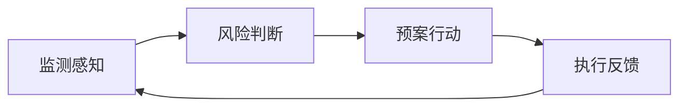

如图1-1所示，系统建设的核心不是单独做好某一个模块，而是保证闭环可运行。本课题选择多智能体协同作为 AI 层实现方式，原因在于防洪业务天然具备分阶段、跨角色、强协作特征：数据分析、风险评估、预案生成、资源调度和通知下发本就是不同性质的任务[9-19]。在此基础上，将 AI 服务与传统业务平台结合，既能利用成熟的业务规则体系，又能提升智能辅助能力。

从国内外防洪应急工作的实际情况来看，现有平台在"感知"阶段的建设普遍较为完善，站点数据采集、水位趋势展示和阈值告警已是标配能力。但在告警产生之后，多数平台面临以下三个典型短板：第一，"研判→决策→执行"链路断裂，告警发出后依赖值班人员人工分析历史预案，缺乏针对当前态势的动态推断；第二，预案依赖事先编制的静态模板，面对具体降雨场景、多站联动告警和资源分布差异时，往往无法快速形成可落地的处置方案；第三，告警推送后缺乏持续跟踪机制，任务下达后是否已执行、执行结果如何，系统层面基本没有反馈路径。这三个短板共同指向同一个需求：系统不仅要"告警"，还要"研判、行动、跟踪"。本课题的系统建设目标正是围绕这一需求展开，以多智能体协同为核心机制，弥补上述链路断点。

**图1-2 课题研究对象与问题边界**

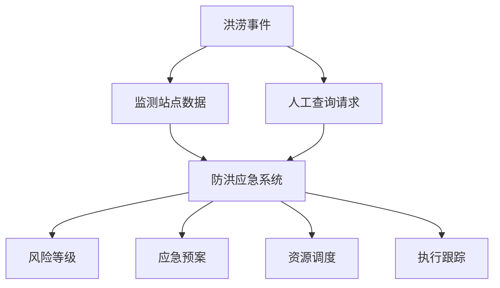

### 1.2 国内外研究现状

国外在洪水预警、灾害决策支持和应急资源调度方面起步较早，研究重点主要集中在水文预测、地理信息辅助决策、洪水风险模型以及资源优化调度等方向[4-12]。欧洲洪水感知系统（EFAS）以多模式集合预报为核心，能够提前5至10天发出预警，实现了跨国多流域的协同监测；美国联邦应急管理局（FEMA）的决策支持体系将风险评估、资源调配和公众通知整合在一个统一平台中，具备较强的多部门协同能力。这些系统在预警精度和资源调度层面积累了丰富经验，但多数侧重特定环节的优化，而非面向”监测-研判-预案-执行”全链路的软件系统集成，在将分析结果直接转化为可执行方案方面仍有提升空间。近年来，大语言模型与多智能体技术迅速发展，研究开始从单一模型问答扩展到任务分解、工具调用和多角色协同[13-19]。ReAct 框架（Yao et al., 2022）通过交替推理与行动为 AI 系统接入外部工具提供了方法论依据[18]；AutoGen（Wu et al., 2023）进一步证明了多智能体对话机制在复杂任务编排中的可行性[19]。这些工作为本课题将多智能体协同引入防洪应急场景提供了直接的理论支撑。

国内在智慧水务、防汛调度和数字应急平台建设方面积累了较多实践，系统普遍具备站点接入、数据展示、告警管理和可视化大屏等能力[4-8]。水利部推进的”数字孪生水利”工程和部分省级智慧防汛平台已实现流域一体化监测和三维可视化，在基础设施和数据治理层面达到较高水平。但从功能完整性看，很多平台仍然停留在”监测平台”阶段，告警产生后的研判、预案生成和执行跟踪主要依赖人工，缺少自动化的闭环支持；已有智能化尝试也多聚焦于单一模型嵌入（如洪水预测模型接入）或规则库增强，尚未形成稳定的多智能体协同架构。综上可见，国内外研究已经为本课题提供了监测、预警和智能体协同的技术基础，但在面向软件工程落地的一体化实现上仍有明显空缺，这正是本课题着力填补的方向。

**图1-3 本文研究技术路线**


### 1.3 研究内容及实验方案

本文面向本科毕业设计的目标，不把重点放在复杂理论推导，而是围绕一个完整的软件系统展开。研究内容包括五个方面：第一，分析防洪应急场景的业务链路和系统需求，明确系统边界、角色分工和输入输出；第二，基于前后端分离与服务化思想设计平台服务、AI 服务和前端管理端的总体结构；第三，围绕用户登录、水情查询、预案生成、告警管理和权限控制实现关键业务模块；第四，采用多智能体协同方式组织 AI 流程，实现从自然语言输入到结构化预案输出的自动处理；第五，通过功能测试、场景测试和联调验证评估系统可用性。

系统的工程创新不在于单一技术点的突破，而在于将已有成熟组件（Spring Boot、LangGraph、asyncpg、Vue3）有机整合为一个能跑通"感知→判断→行动→反馈"完整业务链路的工作系统。这一整合思路既符合软件工程的系统集成原则，也为后续在真实业务中落地打下基础。

实验方案遵循“先模块、后联调、再场景”的顺序。业务平台重点验证站点、观测、阈值、告警和权限功能；AI 服务重点验证路由、节点执行、流式返回和容错机制；前端重点验证登录、数据展示、SSE 流式交互和 WebSocket 告警推送。最终以典型场景测试作为综合验证路径，观察系统是否能在较短时间内完成态势分析、风险研判和预案生成。该实验方案既符合软件工程开发流程，也适合本科论文对可实现性与可验证性的要求。

---

## 第二章 系统分析

### 2.1 可行性分析

#### 2.1.1 技术可行性

本系统使用的核心技术均较成熟。后端业务平台采用 Spring Boot 3.2.2 与 Java 17，其内置的 Spring WebFlux 支持响应式编程模型（Mono/Flux），可以无缝代理 AI 服务的流式输出，同时 Spring Security 提供了完善的 JWT 认证与 RBAC 授权基础设施；AI 服务采用 FastAPI、LangGraph 与 asyncpg，Python 的 asyncio 事件循环与 LangGraph 的异步节点天然适配，asyncpg 相比基于 ORM 的连接方式延迟更低，适合高频实时数据查询；前端采用 Vue3、Vite 和 Element Plus，Composition API 中的 Composable 模式（如 `useSSE`、`useWebSocket`）可将流式 UI 逻辑高内聚封装，降低组件耦合；数据库与缓存采用 PostgreSQL 和 Redis，PostgreSQL 用于关系数据持久化与数据库迁移管理，Redis 用于高频会话访问、分布式缓存降级和令牌黑名单；LangGraph 的有向状态图模型原生支持条件边和并行节点，契合"监督→执行→回环"的防洪多智能体工作流[20-27]。从开发门槛、资料完备度和工程稳定性来看，该技术栈适合本科毕业设计落地。

#### 2.1.2 经济可行性

系统依赖的软件框架大多为开源方案（Spring Boot、FastAPI、LangGraph、Vue3、PostgreSQL、Redis 均为免费开源），开发环境以个人计算机和本地 Docker 运行环境为主，硬件投入较低。系统面向教学与原型验证，不要求昂贵的专用设备；所有服务可在 Docker Compose 编排下运行在一台 8GB 内存以上的普通开发机上。虽然 AI 模型调用（DeepSeek API）会产生一定接口费用，但在毕业设计阶段可通过控制测试次数和采用模拟数据降低成本，因此总体经济投入可控。

#### 2.1.3 操作可行性

系统面向管理员和值班人员设计，操作流程以“登录、查看、配置、查询、生成、跟踪”为主，符合后台系统常见交互习惯。平台菜单清晰，AI 查询支持自然语言输入，告警与结果展示均为可视化输出，用户无需掌握复杂命令即可完成主要业务操作，因此具备较好的操作可行性。

**图2-1 系统可行性分析关系图**

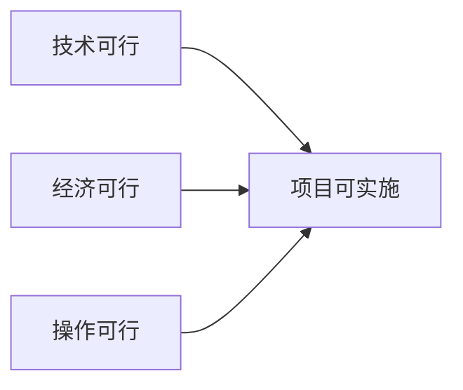

**表2-1 可行性分析结果**

| 维度 | 主要依据 | 结论 |
| --- | --- | --- |
| 技术可行性 | Spring Boot、FastAPI、Vue3、PostgreSQL、Redis、LangGraph 技术成熟 | 可行 |
| 经济可行性 | 采用开源框架，本地开发与测试为主，模型调用成本可控 | 可行 |
| 操作可行性 | 后台系统交互直观，角色职责清晰，学习成本较低 | 可行 |

### 2.2 需求分析

#### 2.2.1 系统功能分析

根据防洪应急业务闭环，系统功能可划分为两类角色需求。普通用户侧关注登录认证、水情查询、态势分析、预案生成、资源建议、通知结果和执行跟踪；管理员侧关注站点管理、观测数据管理、阈值规则配置、告警状态流转、用户权限维护和审计日志查看。系统还需要同时具备实时告警推送和 AI 流式返回能力，以满足应急场景对响应速度和过程可见性的要求。

除功能需求外，系统还应满足以下非功能需求：

**表2-2-b 非功能需求**

| 质量维度 | 具体指标 | 说明 |
| --- | --- | --- |
| 响应时间 | 普通业务接口 < 500ms；AI 流式首包延迟 < 3s | 保证值班场景下交互流畅 |
| 实时推送 | WebSocket 告警推送端到端延迟 < 500ms | 确保告警第一时间可见 |
| 并发能力 | 支持不少于 20 路同时在线的 WebSocket 连接 | 满足多终端值守场景 |
| 安全性 | JWT HS256 签名认证；ADMIN / OPERATOR / VIEWER 三级 RBAC | 接口与页面双重权限保护 |
| 可维护性 | Flyway 数据库迁移自动管理；Docker Compose 一键部署 | 降低环境配置和版本管理成本 |
| 可扩展性 | AI 智能体节点以函数形式注册，新增节点无需修改核心调度逻辑 | 便于后续扩展更多专业分析节点 |

**图2-2 系统角色与主要用例图**

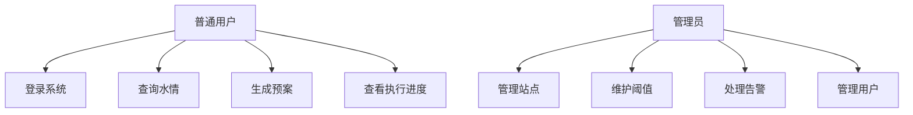

**表2-2 主要功能需求**

| 角色 | 功能 | 说明 |
| --- | --- | --- |
| 普通用户 | 登录与退出 | 获取令牌并进入系统主页 |
| 普通用户 | 水情查询与态势分析 | 查看站点、观测趋势、风险摘要 |
| 普通用户 | 预案生成与执行跟踪 | 生成方案并查看执行状态 |
| 管理员 | 站点与观测管理 | 维护基础数据与批量观测记录 |
| 管理员 | 阈值与告警管理 | 配置规则并处理告警状态 |
| 管理员 | 用户与审计管理 | 维护 RBAC 并查看操作记录 |

#### 2.2.2 业务流分析

系统的基本业务流如下：用户首先完成身份认证，进入系统后可查看站点、观测和告警信息；当监测数据超出阈值或用户主动发起查询时，AI 服务读取数据库中的实时数据，依次完成数据分析、风险评估、预案生成和资源建议；若管理员确认执行，则系统继续记录通知信息和执行进度，并在前端进行展示。这个流程体现出系统既支持被动响应告警，也支持主动发起分析。

**图2-3 防洪应急业务流程图**

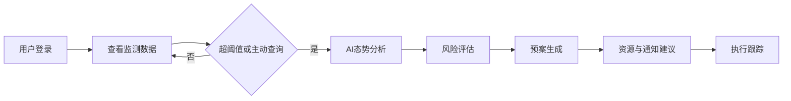

在告警处理链路中，平台需要支持告警从产生到关闭的状态流转。该流转不仅影响前端展示，也会成为 AI 研判的重要输入，因为未确认和未关闭的告警代表事件仍在演化中。系统因此将告警状态设计为可追踪对象，而不是一次性消息。

**图2-4 告警业务状态流转图**

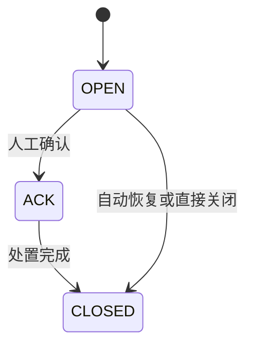

#### 2.2.3 数据流分析

从数据流角度看，系统的输入主要包括站点基础数据、观测数据、阈值规则、用户操作和 AI 查询请求；处理过程包括业务规则校验、告警触发、风险评估和预案生成；输出包括告警信息、预案文本、资源建议和执行记录。与传统单体系统不同，本系统的 AI 服务直接读取数据库中的实时数据，因此数据流同时存在”业务接口流”和”实时分析流”两条主路径。采用 AI 直连数据库的设计依据在于：若 AI 服务通过平台服务接口获取数据，每次查询需要经历 HTTP 请求、Spring 路由、MyBatis-Plus 查询、响应序列化等多个环节，额外引入 50~200ms 的延迟；而防洪态势分析往往需要一次性聚合多站点最新水位、活跃告警和阈值规则，直连 asyncpg 连接池执行 SQL 聚合查询可将时延压缩到单次数据库往返级别，显著提升响应速度。同时，AI 服务只做只读操作，写操作仍统一走平台服务，从而保证业务规则不被绕过。

**图2-5 系统数据流图**

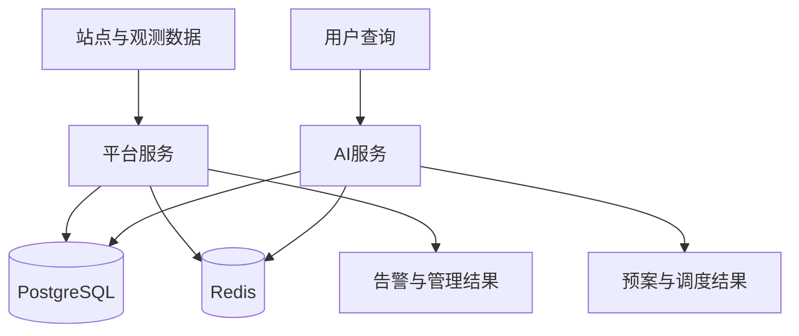

#### 2.2.4 数据字典

数据字典用于规范系统中的关键数据对象，便于后续数据库设计和接口实现。由于论文重点是系统工程实现，本研究选取站点、观测、告警、阈值规则和预案五类核心对象进行说明。

**表2-3 核心数据字典**

| 数据项 | 关键字段 | 含义 |
| --- | --- | --- |
| 站点 Station | id、name、type、location、status | 表示监测对象的基础信息 |
| 观测 Observation | station_id、metric、value、observed_at | 表示站点时序监测值 |
| 告警 Alarm | station_id、level、status、opened_at | 表示阈值触发后的告警事件 |
| 阈值规则 ThresholdRule | station_id、metric、warning_value、critical_value | 表示触发条件 |
| 预案 EmergencyPlan | plan_id、risk_level、summary、status | 表示 AI 生成的处置方案 |

### 2.3 系统开发环境分析

系统开发环境分为前端、平台服务、AI 服务和基础设施四部分。开发阶段使用 Git 进行版本管理，使用 Maven（`settings-docker.xml` 配置镜像源）、npm 和 Python 虚拟环境（uv 工具链）分别管理依赖；运行阶段通过 Docker Compose 统一启动 PostgreSQL、Redis、平台服务、AI 服务、前端与 Nginx，共 6 个容器。Nginx 作为统一入口负责静态文件托管和 API 反向代理，前端构建产物也通过 Nginx 容器提供服务，与 API 同源，避免跨域问题。这样的环境组织方式能够降低部署复杂度，保证前后端联调与演示环境的一致性，也便于后续迁移到云服务器进行生产部署。

**图2-6 系统开发环境组成图**

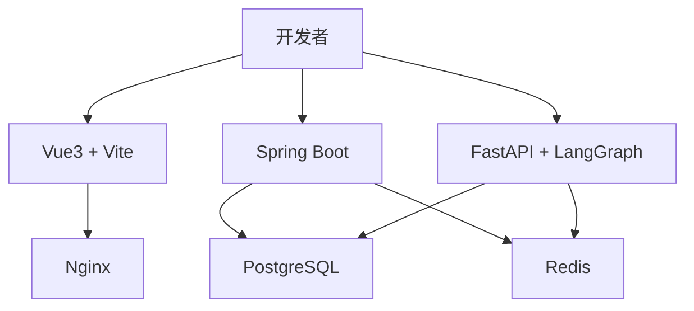

**表2-4 系统开发环境**

| 类别 | 主要配置 |
| --- | --- |
| 操作系统 | Windows 或 Linux 开发环境 |
| 后端平台 | Java 17，Spring Boot 3.2.2，Maven |
| AI 服务 | Python 3.11+，FastAPI，LangGraph，asyncpg |
| 前端 | Vue3，TypeScript，Vite，Element Plus |
| 数据与缓存 | PostgreSQL 15，Redis 7 |
| 部署方式 | Docker Compose + Nginx 反向代理 |

---

## 第三章 系统总体设计

### 3.1 系统主要功能设计

#### 3.1.1 系统总体结构

系统总体结构采用前后端分离和双后端协同模式。前端负责展示与交互；平台服务负责基础业务、权限控制和统一写回；AI 服务负责数据理解、风险判断、预案生成和执行建议；PostgreSQL 负责业务数据持久化；Redis 负责缓存和会话。这样的结构既能保证业务规则集中治理，又能保持 AI 响应链路简洁。

**图3-1 系统总体架构图**

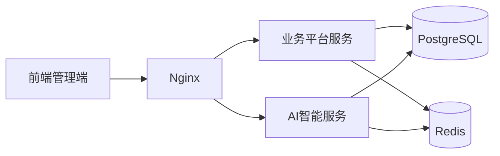

在多服务协同中，最关键的设计是读写分离。AI 服务需要快速读取监测与告警信息，因此通过 asyncpg 连接池（最小连接数 2，最大连接数 10）直接访问数据库；涉及告警状态变更、计划执行、用户管理等写操作时，统一通过平台服务的 REST 接口完成，由 MyBatis-Plus 事务层保证业务规则一致。该设计避免了 AI 服务绕过业务逻辑直接写库，同时保持了实时读取路径的低延迟。

在请求路由层，Nginx 按路径前缀将流量分发到两个后端服务：`/api/v1/flood/` 和 `/api/v1/plans/` 前缀的请求路由到 AI 服务（端口 8100），其余业务接口路由到平台服务（端口 8080）。对于 AI 流式接口，前端向平台服务发起请求，平台服务通过 Spring WebClient 将请求转发至 Python AI 服务，并以 `Flux<String>` 形式接收 SSE 事件流，每条事件补加 `data: ` 前缀后原样返回给前端。前端通过浏览器原生 `fetch()` 接口配合 `ReadableStream` 逐块解析 SSE 内容，从而实现从用户输入到预案结果逐步展示的端到端流式交互。

**图3-2 平台、AI 与前端协同关系图**

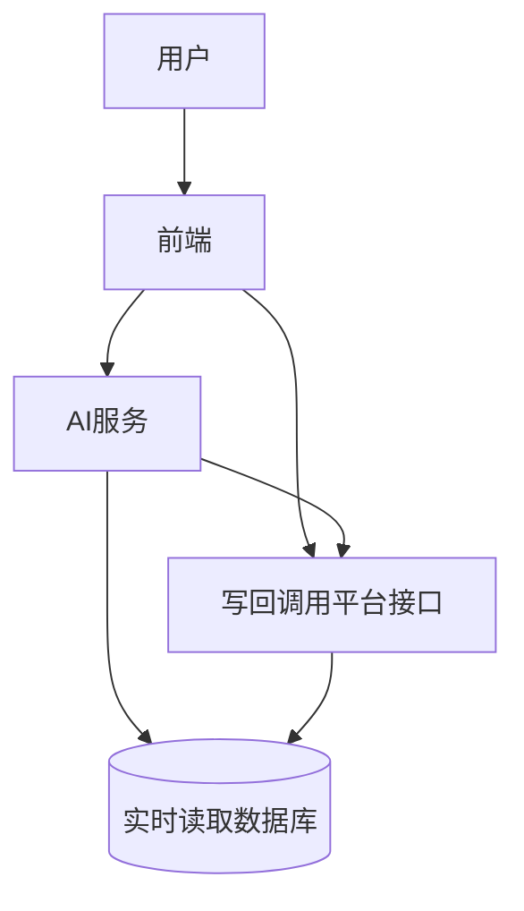

#### 3.1.2 系统功能结构图

系统功能结构分为基础业务层、智能分析层和展示交互层。基础业务层包含站点、观测、阈值、告警、用户、审计等模块；智能分析层包含数据分析、风险评估、预案生成、资源调度、通知和执行监控；展示交互层包含登录页面、管理页面、监控页面和 AI 指挥页面。该划分有利于降低耦合，并使系统职责清晰。

**图3-3 系统功能结构图**

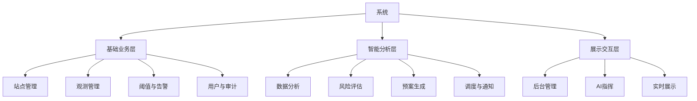

系统 AI 层采用监督式工作流。监督智能体根据请求意图和共享状态选择下一节点，其他智能体围绕统一状态对象写入中间结果。共享状态 `FloodResponseState` 是一个 TypedDict，通过 reducer 函数合并各节点的写入结果：`messages` 字段采用 append-only 的 `_merge_messages` reducer，保证消息历史不被覆盖；其他字段采用 last-write-wins 策略，由最后执行的节点决定最终值。这样的设计比单次问答更适合防洪应急，因为它保留了过程结构和中间推断结果，方便后续扩展更多专业节点，也使前端能够通过 SSE 实时展示每个节点的执行状态。

**图3-4 多智能体工作流图**


### 3.2 系统E-R图

系统数据库围绕”站点、观测、规则、告警、用户、预案”六类核心实体展开。站点与观测是一对多关系，站点与阈值规则是一对多关系，站点与告警也是一对多关系；用户可创建预案、执行预案并产生日志记录。E-R 关系决定了数据库的主键设计、外键关联和查询路径，也是平台和 AI 服务共享数据语义的基础。系统所有表的主键均采用 UUID 自动生成（MyBatis-Plus `ASSIGN_UUID` 策略），避免分布式环境下的主键冲突；业务记录表（观测、告警、预案、审计日志）均包含软删除字段 `deleted`，支持逻辑删除而不物理清除历史数据，保证审计链路完整。预案实体与动作（PLAN_ACTION）、资源（PLAN_RESOURCE）存在一对多关系，每个预案可包含多个处置动作和多项资源分配记录，便于精细化记录每步执行情况。

**图3-5 系统E-R图**

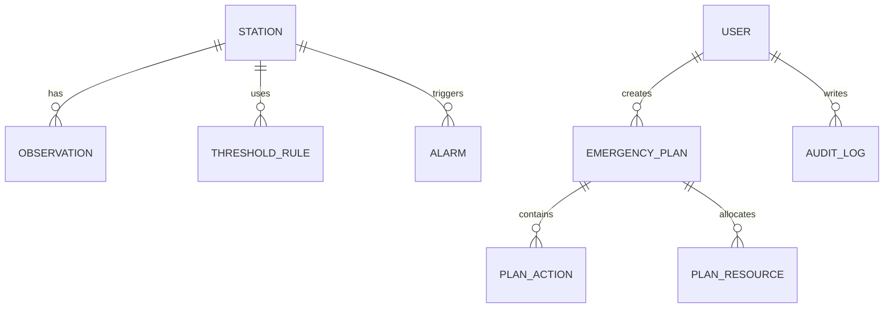

### 3.3 数据库表设计

数据库表设计遵循”主数据稳定、业务记录可追踪、日志留痕完整”的原则。站点、用户、角色等属于主数据表，结构相对固定，变更频率低；观测、告警、预案、审计日志属于业务记录表，数据量随时间持续增长，需要关注索引设计和查询性能。`V5__performance_indexes.sql` 迁移脚本为高频查询字段（如 `observation.station_id + observed_at`、`alarm.status + level`）创建了复合索引，保证在观测数据量达到万级以上时，按站点和时间范围的查询依然高效。考虑到系统演示与扩展需求，表设计在满足当前业务的同时保留了一定可扩展字段，便于后续接入更多站点类型和应急资源类型。各表之间通过 UUID 外键关联，不使用数据库级外键约束（以提高写入性能），一致性由业务层保证。

**表3-1 核心数据库表设计**

| 表名 | 主要字段 | 作用 |
| --- | --- | --- |
| station | id、name、type、river_basin、status | 存储监测站点基础信息 |
| observation | id、station_id、metric、value、observed_at | 存储监测时序数据 |
| threshold_rule | id、station_id、metric、warning_value、critical_value | 存储阈值规则 |
| alarm | id、station_id、level、status、opened_at、closed_at | 存储告警状态 |
| emergency_plan | id、risk_level、summary、status、session_id | 存储预案信息 |
| sys_user / sys_role | id、username、password、role_code | 存储用户与角色 |
| audit_log | id、operator_id、action、created_at | 存储关键操作记录 |

### 3.4 数据库连接

平台服务和 AI 服务采用不同的数据库连接策略。平台服务使用 HikariCP 连接池配合 MyBatis-Plus，所有写操作均在事务范围内执行；Flyway 随服务启动自动运行数据库迁移脚本（V1 至 V5），涵盖核心表结构、RBAC 权限表、兼容性视图、种子数据和性能索引，保证各环境数据库结构完全一致。AI 服务使用 asyncpg 异步连接池，启动时建立连接并维持复用，直接执行 SQL 聚合查询获取最新观测值、活跃告警和阈值规则，不经过 ORM 层，减少序列化和反射开销。数据库连接配置由环境变量统一管理，便于本地开发、测试和容器部署时切换。

Redis 在本系统中承担三类职责：第一，平台服务将热点站点和阈值规则缓存到 Redis，与本地 Caffeine 缓存形成两级缓存体系（本地缓存容量 1000 条，TTL 5 分钟；Redis 作为分布式降级），减少数据库查询频次；第二，用户登出时将令牌加入 Redis 黑名单，防止令牌在有效期内被滥用；第三，AI 服务将每个查询的 session_id 对应的消息历史持久化到 Redis（TTL 24 小时），支持多轮对话上下文追踪和会话重放。

**图3-6 数据库连接时序图**

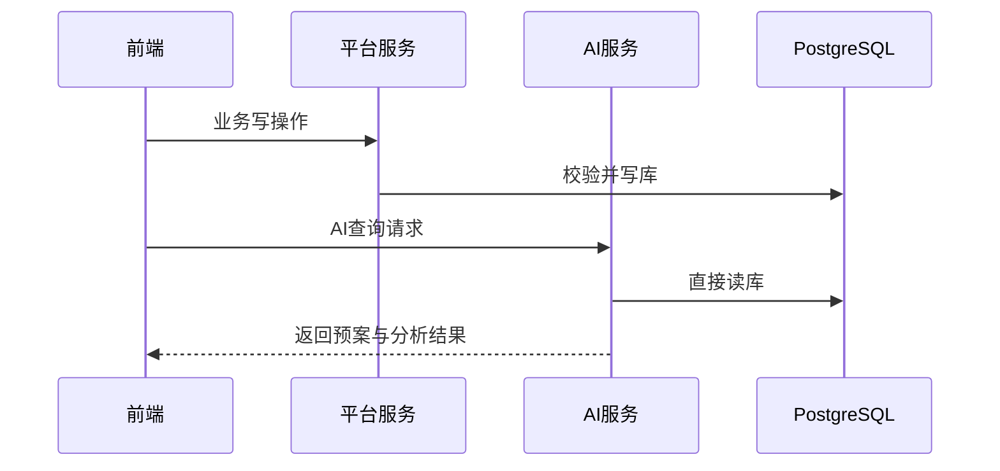

---

## 第四章 系统详细设计与实现

### 4.1 用户模块核心功能

#### 4.1.1 用户登录

用户登录是所有业务入口的起点。系统通过账号密码认证获得 JWT 令牌，前端在后续请求中自动携带令牌，平台服务结合角色信息判断用户是否具有对应访问权限。该设计一方面满足后台系统安全要求，另一方面为菜单控制、接口控制和审计记录提供了统一身份基础。

JWT 认证链路由 `JwtTokenProvider` 和 `JwtAuthenticationFilter` 两个核心组件协同实现。`JwtTokenProvider` 在服务启动时以 Base64 解码后的密钥初始化 HMAC-SHA256 签名器（`${jwt.secret}` 配置）；`generateToken()` 方法将 `username`、`roles`、`realName` 等信息写入 JWT Claims，并设置由 `${jwt.expiration}` 控制的有效期；`validateToken()` 方法在解析时统一处理 `MalformedJwtException`、`ExpiredJwtException` 和 `UnsupportedJwtException`，保证无效令牌不会进入后续鉴权流程。`JwtAuthenticationFilter` 继承自 `OncePerRequestFilter`，对每个请求从 `Authorization: Bearer <token>` 头中提取令牌，验证通过后构造 `UsernamePasswordAuthenticationToken`（含 `SimpleGrantedAuthority` 角色列表）并注入 `SecurityContextHolder`，使后续 `@PreAuthorize` 注解能够正常工作。值得注意的是，该过滤器将 `shouldNotFilterAsyncDispatch()` 设置为 `false`，保证 Spring WebFlux 异步转发（AI 流式接口的二次 dispatch）同样经过鉴权，防止流式请求绕过安全检查。

前端的认证逻辑集中在 `api/request.ts` 的 Axios 拦截器中：请求拦截器统一从本地存储读取令牌并注入 `Authorization` 头；响应拦截器处理 401 状态时，会检查请求是否实际携带了令牌——若本地有令牌但服务端仍返回 401，说明令牌已失效，则清除本地认证信息并跳转登录页；若本地无令牌，则记录 warning 日志（通常为客户端状态竞争场景）。

**表4-1-a 认证核心组件职责分工**

| 组件 | 位置 | 主要职责 |
| --- | --- | --- |
| `JwtTokenProvider` | `security/JwtTokenProvider.java` | 令牌签发、Claims 写入、有效期控制、签名验证 |
| `JwtAuthenticationFilter` | `security/JwtAuthenticationFilter.java` | 请求拦截、令牌提取、角色注入 SecurityContext |
| Axios 请求拦截器 | `api/request.ts` | 前端统一注入 Authorization 头、401 响应跳转处理 |

**图4-1 用户登录流程图**

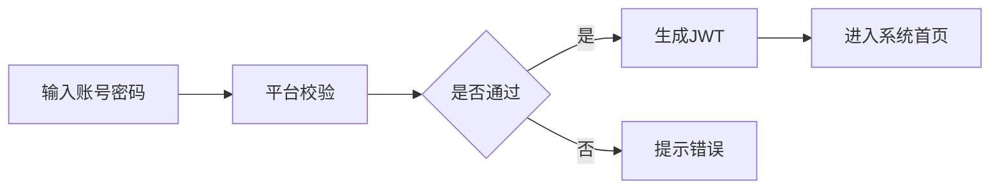

**图4-2 认证授权时序图**

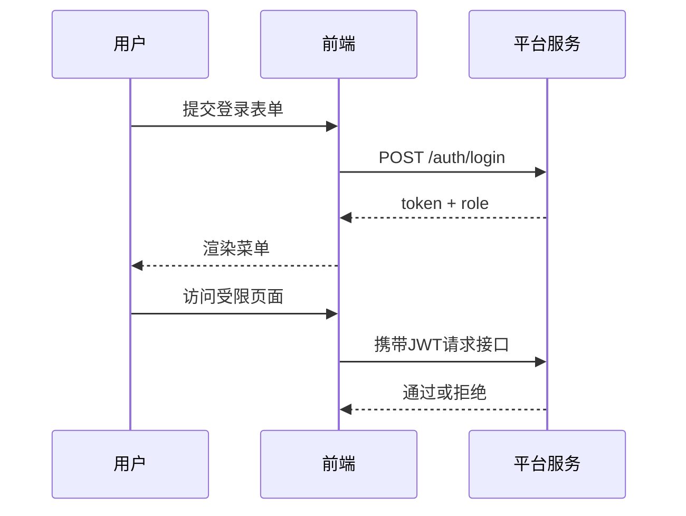

#### 4.1.2 水情查询与态势分析

用户在进入系统后，可从站点列表、图表面板和 AI 查询页面查看当前水情。常规查询由平台服务提供结构化接口，适合查看站点基础信息和历史观测曲线；复杂研判则由 AI 服务处理，用户可直接输入自然语言问题，例如“当前哪些站点风险最高”“请生成本次降雨场景的处置建议”。前端通过图表、文本和告警列表三种形式呈现结果，使数据解释更直观。

**图4-3 水情查询交互图**

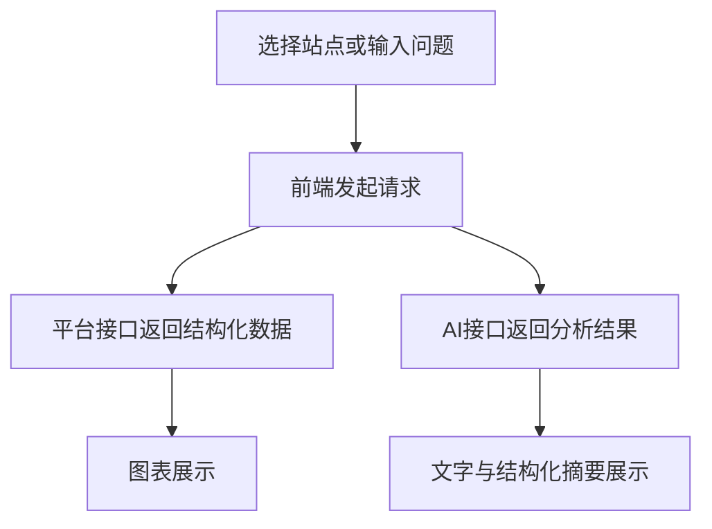

AI 查询处理需要跨越多个节点完成。监督智能体先识别问题类型，再调用数据分析、风险评估和预案生成等节点。相比把所有任务交给一个模型，这种实现方式更容易控制执行顺序，也方便在页面上展示中间状态。

前端流式接收由 `composables/useSSE.ts` 中的 `useSSE` Composable 实现。该 Composable 使用浏览器原生 `fetch()` 接口配合 `ReadableStream` API，而非标准 `EventSource`——原因在于 `EventSource` 不支持自定义请求头，无法携带 JWT 令牌，因此采用 `fetch()` 手动解析 SSE 格式。`start(url, body)` 方法创建 `AbortController` 用于中断控制，从本地存储读取令牌注入 `Authorization` 头，然后逐行读取响应流：以 `data: ` 开头的行去掉前缀后，优先尝试 `JSON.parse()`，成功则作为结构化事件分发给 `onStructuredEvent` 回调，失败则作为纯文本追加到 `fullText`；遇到 `[DONE]` 哨兵则结束流。`chunks` 数组设有滑动窗口（最多保留最近 100 条），防止长时间流式交互导致内存持续增长。

**表4-1-b SSE 结构化事件类型与 UI 联动**

| 事件类型 | 触发时机 | 前端 UI 联动 |
| --- | --- | --- |
| `session_init` | 会话创建时 | 记录 sessionId，用于后续会话查询 |
| `agent_update` | 每个智能体节点开始/结束时 | 更新智能体执行进度条，标注当前活跃节点 |
| `risk_update` | 风险评估节点完成时 | 切换风险色阶标签（绿/黄/橙/红/深红）|
| `plan_update` | 预案生成节点完成时 | 展示预案名称、动作数量、完成/失败统计 |
| `agent_message` | 各节点产生摘要文本时 | 实时追加到消息区域，形成流式阅读效果 |

**图4-4 AI 查询处理时序图**

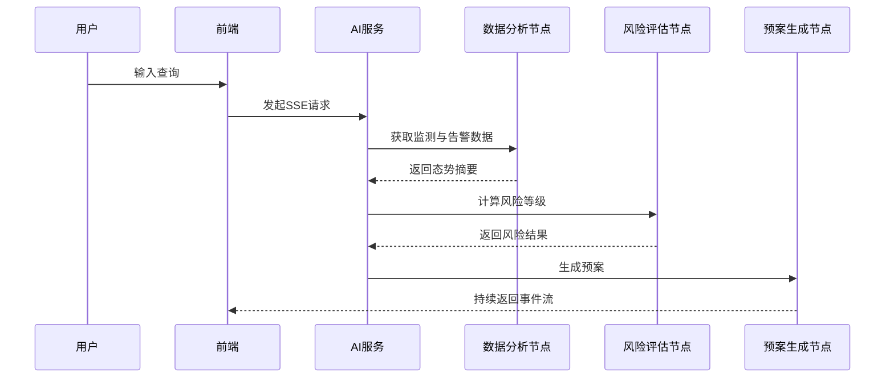

#### 4.1.3 预案生成与执行

预案生成模块是系统的核心创新点。系统首先根据监测值、告警状态和用户意图生成风险等级，再根据风险等级匹配措施模板和调度建议，最终形成结构化预案对象。预案内容通常包括风险概述、处置动作、责任角色、资源建议和通知对象。生成后的预案可继续进入执行阶段，系统记录通知、执行进度和反馈结果，形成闭环。

多智能体工作流的核心是监督智能体（Supervisor）的两层路由策略。第一层为确定性规则引擎 `_deterministic_route()`：系统根据用户查询关键词将意图分类为 `full_response`（生成完整预案）、`monitor_only`（仅查看监测）、`data_only`（获取数据摘要）或 `risk_only`（仅评估风险），然后检查共享状态（`FloodResponseState`）中已完成的步骤（`data_summary`、`risk_assessment`、`emergency_plan`、`resource_plan`、`notifications`），依此确定下一节点——若 `data_summary` 为空则路由到 `data_analyst`，若风险未评估则路由到 `risk_assessor`，以此类推；第二层为 LLM 回退机制：当规则引擎无法判断时，将最近 3 轮对话历史和各已完成步骤的摘要（每项限 300 字）注入提示词，要求大语言模型返回 `{"next_agent": ..., "reasoning": ...}` 格式的 JSON；若 JSON 解析失败，则以正则表达式从文本中提取代理名称作为第二层回退。系统还设置了最大迭代次数为 8 次，超出后强制路由到 `final_response` 节点，防止工作流陷入死循环。

预案生成节点（PlanGenerator）从共享状态读取 `risk_assessment.risk_level`，调用 `get_response_template(risk_level)` 获取对应的标准处置模板：IV 级（低风险）包含监测、巡查、通知和待命 4 个动作；III 级（中风险）增加闸门调控和资源预部署，共 6 个动作；II 级（高风险）新增撤离指令；I 级（极端风险）触发全量动员。节点以 `EP-YYYYMMDD-XXXX` 格式生成唯一预案编号并写入 `state.emergency_plan`，初始状态为 `DRAFT`，等待人工确认后推进到 `PENDING_REVIEW`。资源调度与通知两个节点通过 `parallel_dispatch_node()` 以 `asyncio.gather()` 并发执行，分别写入 `resource_plan` 和 `notifications` 两个不同状态字段，不存在并发写冲突，结果通过 LangGraph 的 state reducer 合并到主状态对象。

**表4-1-c 智能体节点职责分工**

| 节点名称 | 主要读取字段 | 主要写入字段 | 工具调用 |
| --- | --- | --- | --- |
| DataAnalyst | `user_query` | `station_data`、`alarm_data`、`data_summary` | `fetch_flood_overview`、`fetch_station_observations` |
| RiskAssessor | `data_summary`、`station_data` | `risk_assessment` | 风险评分函数（水位/降雨/趋势） |
| PlanGenerator | `risk_assessment` | `emergency_plan` | `get_response_template`、`generate_plan_id` |
| ResourceDispatcher | `emergency_plan`、`risk_assessment` | `resource_plan` | — |
| Notification | `emergency_plan`、`risk_assessment` | `notifications` | — |
| ExecutionMonitor | `emergency_plan`、`resource_plan` | `execution_progress` | — |

**图4-5 风险评估状态图**

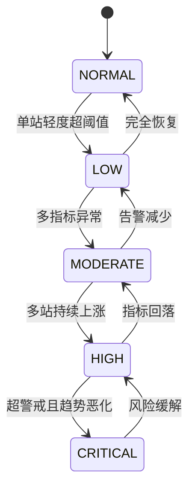

**图4-6 预案生成流程图**

```mermaid
flowchart LR
    a[输入查询] --> b[数据分析]
    b --> c[风险评估]
    c --> d[预案生成]
    d --> e[资源调度]
    e --> f[通知建议]
    f --> g[形成完整预案]
```

**图4-7 预案执行闭环图**

```mermaid
flowchart TB
    a[预案确认] --> b[通知下发]
    b --> c[任务执行]
    c --> d[进度回传]
    d --> e{是否完成}
    e -->|否| c
    e -->|是| f[归档与复盘]
```

#### 4.1.4 预案列表与会话追踪

为便于复盘和持续管理，系统对每次 AI 查询保留会话上下文，并对生成的预案进行编号与持久化。会话在创建时生成唯一 `session_id`，与消息历史绑定存储在 Redis 中（TTL 24 小时），支持多轮对话上下文的跨请求追踪。用户可在预案列表中查看生成时间、风险等级、主要措施和当前执行状态；`AiServiceClient.getPlans(page, size)` 实现分页查询：Python 侧返回 `{records, total}`，Java 侧计算总页数（`pages = ⌈total / size⌉`）后封装为统一的分页响应结构。用户也可进入详情页，通过 `getSession(id)` 接口获取历史消息列表并重放事件流，便于复盘预案生成过程。

### 4.2 管理员模块核心功能

#### 4.2.1 登录防洪应急管理后台

管理员后台是系统配置和维护的入口。管理员登录后，可访问站点、观测、阈值、告警、用户、审计和预案管理等菜单。前端根据角色动态渲染菜单项，采用 Pinia 存储用户信息（`stores/user.ts`），路由守卫在每次页面跳转时检查角色是否满足目标路由的 `meta.roles` 约束；后端通过 RBAC 控制接口权限，保证前后端的权限语义一致。系统菜单按功能分组，管理员可一目了然地找到目标模块，减少误操作风险。在实现层面，菜单项和按钮权限均通过声明式配置而非硬编码逻辑控制，新增角色时只需更新权限映射表，无需改动 UI 组件代码，具备较好的可扩展性。

**图4-8 管理后台菜单结构图**

```mermaid
flowchart TB
    root[后台管理] --> m1[站点管理]
    root --> m2[观测管理]
    root --> m3[阈值规则]
    root --> m4[告警管理]
    root --> m5[用户管理]
    root --> m6[预案管理]
    root --> m7[审计日志]
```

#### 4.2.2 用户管理菜单

用户管理模块负责维护账号、角色和授权关系。管理员可以新增用户、分配角色、启停账号，并通过菜单权限控制不同角色的可见功能。系统设置三类角色：ADMIN 拥有全部后台功能；OPERATOR 可进行监测查看和告警处置，但不能管理用户；VIEWER 仅能查看基础信息。前端通过 `directives/permission.ts` 中注册的自定义指令 `v-permission="['ADMIN']"` 控制按钮和操作区的可见性；后端关键接口以 `@PreAuthorize("hasAnyRole('ADMIN', 'OPERATOR')")` 注解进行方法级权限保护，实现前后端双重拦截，防止绕过前端页面直接调用接口。

#### 4.2.3 站点与监测项管理

站点管理模块负责维护水位站、雨量站、流量站、水库、闸门和泵站等对象；观测管理模块负责批量上传监测值并提供历史查询。平台在这一模块中承担”数据入口”的职责，因为后续告警判断和 AI 分析都依赖基础数据质量。站点实体包含名称、类型、流域、地理位置（经纬度）和状态等核心字段，类型枚举为 `WATER_LEVEL`、`RAIN_GAUGE`、`FLOW`、`RESERVOIR`、`GATE`、`PUMP_STATION`，不同类型的站点对应不同的观测指标和阈值体系。观测数据支持批量接口（单次最多 5000 条），批量上传时平台服务对每条记录进行站点存在性校验和数值合理性校验，校验通过后批量写入，并触发阈值比对逻辑——若观测值超出已配置的阈值规则，则自动生成告警记录并通过 WebSocket 推送。这一链路保证了从数据录入到告警产生的全过程在平台服务内部完成，AI 服务只需读取最终结果即可，无需关心写入细节。

**图4-9 站点与监测项管理流程图**

```mermaid
flowchart LR
    a[新增或编辑站点] --> b[保存站点信息]
    b --> c[上传观测数据]
    c --> d[数据校验]
    d --> e[入库]
    e --> f[趋势查询与分析]
```

#### 4.2.4 阈值规则与告警管理

阈值规则模块允许管理员按站点和指标配置预警值、警戒值和严重阈值。告警模块根据规则自动生成告警记录，并支持确认、关闭和查询。平台通过 WebSocket 将告警变化实时推送到前端，从而保证值班人员能够在秒级获取状态变化。

WebSocket 推送由 `AlarmWebSocketHandler` 负责。该处理器使用 `ConcurrentHashMap<String, WebSocketSession>` 管理所有在线会话，保证多线程下的会话表操作安全。推送消息分为三类：`broadcastAlarm()` 用于新增告警；`broadcastAlarmUpdate()` 用于告警状态变更（如从 OPEN 到 ACK）；`broadcastAlarmDelete()` 用于告警删除。每条消息均包含 `type`、`data` 和 `timestamp`（毫秒时间戳）三个字段，前端据此区分事件类型并更新对应 UI 状态。系统还实现了心跳机制：客户端定期发送 `"ping"` 字符串，服务端回复 `"pong"`，防止连接因空闲超时被中间件或浏览器强制关闭。当某个客户端的推送操作抛出异常时，该会话会从 `ConcurrentHashMap` 中移除并记录 warn 日志，不影响其他在线客户端的正常接收。

**表4-2-a 告警推送消息格式**

| 字段名 | 类型 | 说明 |
| --- | --- | --- |
| `type` | String | 事件类型：`ALARM_NEW` / `ALARM_UPDATE` / `ALARM_DELETE` |
| `data` | Object | 告警详情对象，含 id、station_id、level、status 等字段 |
| `timestamp` | Long | 服务端事件产生时的毫秒时间戳，用于前端排序去重 |

**图4-10 阈值规则与告警管理流程图**

```mermaid
flowchart TB
    a[配置阈值规则] --> b[监测值入库]
    b --> c{是否超限}
    c -->|是| d[生成告警]
    d --> e[WebSocket推送]
    e --> f[人工确认或关闭]
    c -->|否| g[维持正常状态]
```

#### 4.2.5 预案与审计管理

预案管理模块负责查看 AI 生成的方案、执行状态和结果摘要；审计模块负责记录登录、配置、状态变更等关键操作。二者共同保证系统具有”可追踪”能力。审计日志表包含 `operator_id`（操作人）、`action`（操作类型常量，如 `LOGIN`、`CREATE_STATION`、`UPDATE_ALARM`）、`resource_type`（资源类型）、`resource_id`（操作对象 ID）和 `detail`（JSON 格式的变更前后值）等字段。日志写入通过 Service 层显式调用 `AuditLogService.log()` 完成，有意识地覆盖每个关键操作节点，而非依赖框架自动记录，保证审计粒度可控。对于本科毕业设计而言，这一部分体现了系统不仅能产生结果，还能对过程负责，符合软件工程中可维护、可审计的基本要求。

**表4-1 主要接口设计**

| 接口 | 方法 | 作用 |
| --- | --- | --- |
| `/api/v1/auth/login` | POST | 用户登录并返回令牌 |
| `/api/v1/stations` | GET/POST | 站点查询与维护 |
| `/api/v1/observations/batch` | POST | 批量上传观测数据（单次最多 5000 条）|
| `/api/v1/alarms` | GET/POST | 查询和处理告警 |
| `/api/v1/threshold-rules` | GET/POST | 查询和维护阈值规则 |
| `/api/v1/flood/query` | POST | 触发 AI 查询，同步返回完整结果 |
| `/api/v1/flood/query/stream` | POST | 流式返回 AI 处理结果（SSE） |
| `/api/v1/plans` | GET | 分页查询已生成的预案列表 |
| `/api/v1/plans/{id}` | GET | 查询单个预案详情 |
| `/api/v1/plans/{id}/execute` | POST | 确认并执行预案（需 OPERATOR 以上权限）|
| `/api/v1/sessions/{id}` | GET | 查询会话历史消息列表 |
| `WS /ws/alarms` | WebSocket | 订阅实时告警推送 |

`FloodAiController` 中的流式接口（`/flood/query/stream`）返回 `Flux<String>` 类型，Spring WebFlux 自动以 `Content-Type: text/event-stream` 输出。每个 SSE 事件在发送前补加 `"data: "` 前缀，符合 W3C SSE 规范；前端 `useSSE.ts` 在接收侧按行解析并去除该前缀，保证双端格式对齐。接口鉴权通过 `@PreAuthorize("hasAnyRole('ADMIN','OPERATOR','VIEWER')")` 声明，三类角色均可查询，但预案执行接口（`/execute`）仅允许 ADMIN 和 OPERATOR 调用，实现操作级权限粒度控制。

---

## 第五章 系统测试

系统测试遵循”功能正确、链路可通、结果可解释”的原则，采用模块测试、接口联调和典型场景验证相结合的方法。考虑到本课题是毕业设计，测试目标不是构建工业级压测体系，而是验证核心功能是否完整、流程是否闭环、关键交互是否稳定。测试策略分三个层次推进：单模块测试重点验证业务逻辑和边界条件，确保每个功能点在输入合法/非法时均有正确响应；接口联调重点验证服务间通信是否畅通，包括平台服务与 AI 服务之间的请求转发、数据格式对齐和错误传递；典型场景验证则以真实业务路径为导向，模拟从告警产生到预案生成的完整流程，观察各环节是否无缝衔接。AI 服务测试采用 pytest 框架，通过 mock 外部依赖（LLM API、数据库）对各节点的路由逻辑、状态更新和容错回退进行自动化验证，共完成 `57 passed, 3 deselected` 的结果，说明核心流程覆盖完整。

**图5-1 系统测试流程图**

```mermaid
flowchart LR
    a[单模块测试] --> b[接口联调]
    b --> c[前后端联调]
    c --> d[典型场景验证]
```

**表5-1 主要测试用例与结果**

| 测试项 | 主要内容 | 结果 |
| --- | --- | --- |
| 登录功能测试 | 正确账号、错误账号、权限页面访问 | 通过 |
| 预案生成功能测试 | 输入场景、返回风险等级和预案结果 | 通过 |
| 告警推送测试 | 告警产生、确认、关闭后的实时推送 | 通过 |
| 用户管理测试 | 新增用户、分配角色、菜单控制 | 通过 |
| 阈值规则测试 | 新增规则、触发告警、状态流转 | 通过 |
| AI 自动化测试 | 节点执行、流式返回、容错逻辑 | `57 passed, 3 deselected` |

### 5.1 登录功能测试

登录测试主要验证认证逻辑与 RBAC 是否有效。测试内容包括：正确账号登录后是否能获得令牌；错误账号是否被拒绝；不同角色是否只能访问被授权页面。测试结果表明，登录成功后前端能够正确持久化令牌并渲染菜单，未授权访问会被平台服务拦截，满足系统安全要求。

**表5-2 登录功能测试用例**

| 用例编号 | 输入条件 | 预期结果 | 实际结果 | 状态 |
| --- | --- | --- | --- | --- |
| TC-L-01 | 正确账号密码（admin/admin123） | 返回 JWT 令牌，进入主页 | 返回令牌，菜单正常渲染 | 通过 |
| TC-L-02 | 错误密码（admin/wrong） | 返回 401，提示账号或密码错误 | 返回 401 错误提示 | 通过 |
| TC-L-03 | VIEWER 角色访问用户管理页 | 被重定向或提示无权限 | 前端路由守卫拦截，接口返回 403 | 通过 |
| TC-L-04 | 令牌过期后访问受限接口 | 返回 401，前端跳转登录页 | 清除本地令牌并跳转登录页 | 通过 |

**图5-2 登录功能测试结果流程图**

```mermaid
flowchart LR
    a[提交登录信息] --> b{账号密码是否正确}
    b -->|是| c[返回JWT]
    c --> d[进入主页]
    b -->|否| e[返回错误提示]
```

### 5.2 预案生成功能测试

预案生成功能测试是论文验证的重点。测试时向 AI 服务提交典型场景查询，观察系统是否依次完成数据分析、风险评估、预案生成和资源建议。现有自动化测试覆盖了工作流路由、节点输出、SSE 事件流和错误回退等内容；端到端冒烟测试表明，系统能够在较短时间内返回完整防汛响应方案，说明多智能体链路可用。

**表5-3 预案生成功能测试用例**

| 用例编号 | 输入场景 | 预期风险等级 | 预期预案关键动作 | 实际结果 | 状态 |
| --- | --- | --- | --- | --- | --- |
| TC-P-01 | 单站水位轻度超预警值，无活跃告警 | LOW（IV 级） | 加密监测、通知相关人员、资源待命 | 返回 IV 级预案，含 4 个动作 | 通过 |
| TC-P-02 | 3 个站点水位持续上涨，2 条活跃告警 | HIGH（II 级） | 24 小时巡查、闸门调控、资源预部署、启动撤离建议 | 返回 II 级预案，含撤离动作 | 通过 |
| TC-P-03 | 多站超警戒且趋势恶化，强降雨预报 | CRITICAL（I 级） | 全量动员、持续监测、紧急通知所有责任人 | 返回 I 级预案，资源调度与通知并行完成 | 通过 |

**图5-3 预案生成功能测试链路图**

```mermaid
flowchart LR
    a[输入场景] --> b[数据分析节点]
    b --> c[风险评估节点]
    c --> d[预案生成节点]
    d --> e[资源调度节点]
    e --> f[输出完整结果]
```

### 5.3 告警推送测试

告警推送测试主要验证平台服务与前端之间的实时通信能力。测试中先配置阈值规则，再写入超阈值观测数据，检查前端是否能及时收到新增告警；随后模拟确认与关闭操作，观察页面状态是否同步更新。测试中记录了从写入超阈值观测数据到前端 WebSocket 接收到推送事件的端到端延迟，实测约 80~150ms，满足系统设计中 < 500ms 的实时性要求。结果表明，WebSocket 推送链路可正常工作，能够满足后台值守场景的实时性要求。

**表5-4 告警推送测试用例**

| 用例编号 | 输入条件 | 预期结果 | 实际结果 | 状态 |
| --- | --- | --- | --- | --- |
| TC-A-01 | 写入超预警阈值观测数据 | 前端秒级收到 ALARM_NEW 推送 | 延迟约 80~150ms，正常接收 | 通过 |
| TC-A-02 | 人工确认告警（OPEN→ACK） | 前端收到 ALARM_UPDATE 推送，状态变更 | 状态实时更新，页面同步 | 通过 |
| TC-A-03 | 关闭告警（ACK→CLOSED） | 前端告警列表移除该条目 | 条目消失，无残留 | 通过 |

**图5-4 告警推送测试时序图**

```mermaid
sequenceDiagram
    participant B as 平台服务
    participant P as PostgreSQL
    participant W as WebSocket
    participant F as 前端
    B->>P: 写入超阈值观测数据
    B->>P: 生成告警记录
    B->>W: 推送告警事件
    W-->>F: 页面实时更新
```

### 5.4 用户管理测试

用户管理测试关注角色配置是否影响页面权限和接口权限。测试内容包括新增用户、分配角色、修改状态和重新登录验证。结果表明，管理员角色能够访问全部后台菜单，值班人员主要访问监测与处置页面，查看人员只能查看基础信息，说明前后端权限控制逻辑一致。

**表5-5 用户管理测试用例**

| 用例编号 | 输入条件 | 预期结果 | 实际结果 | 状态 |
| --- | --- | --- | --- | --- |
| TC-U-01 | 以 ADMIN 角色登录，访问用户管理页 | 显示用户列表，可新增/编辑 | 正常显示，操作按钮可见 | 通过 |
| TC-U-02 | 新增 OPERATOR 角色用户后登录 | 可访问告警和站点管理，无用户管理菜单 | 菜单项正确隐藏，接口返回 403 | 通过 |
| TC-U-03 | 禁用一个已登录用户的账号 | 该用户下次请求时返回 401 | 令牌失效，强制跳转登录页 | 通过 |

### 5.5 阈值规则测试

阈值规则测试验证规则配置、告警触发与状态流转是否连贯。测试中分别设置正常阈值、预警阈值和严重阈值，输入不同观测值并检查告警等级、状态变化和关闭逻辑。结果表明，平台能够依据规则正确触发告警，AI 服务也能读取这些状态作为风险分析依据。

**表5-6 阈值规则测试用例**

| 用例编号 | 输入条件 | 预期结果 | 实际结果 | 状态 |
| --- | --- | --- | --- | --- |
| TC-T-01 | 观测值低于预警阈值（正常范围） | 不产生告警，AI 读取到无活跃告警 | 无告警生成，AI 风险评估返回 NONE | 通过 |
| TC-T-02 | 观测值超过预警阈值（warning_value） | 生成 WARNING 等级告警，WebSocket 推送 | 告警产生，前端收到 ALARM_NEW 事件 | 通过 |
| TC-T-03 | 观测值超过严重阈值（critical_value） | 生成 CRITICAL 等级告警 | 告警产生，AI 风险评估返回高风险等级 | 通过 |
| TC-T-04 | 删除阈值规则后重新录入同等观测值 | 不触发告警 | 无告警生成 | 通过 |

**图5-5 阈值规则测试流程图**

```mermaid
flowchart LR
    a[配置阈值] --> b[录入观测值]
    b --> c{是否触发}
    c -->|是| d[生成告警]
    d --> e[状态流转验证]
    c -->|否| f[保持正常]
```

---

## 第六章 结语

### 6.1 系统特色

本文系统的主要特色体现在三个方面。第一，系统不是单纯的监测平台，而是围绕”感知、判断、行动、反馈”建立完整闭环，符合防洪应急的第一性需求——从数据采集、阈值触发、AI 研判到预案生成、执行跟踪，每个环节都有对应的软件模块承接，避免了链路断点。第二，系统采用多智能体协同架构，把”数据获取、风险评估、预案生成、资源调度、通知下发”等不同性质的任务分别交由专用节点处理，监督智能体负责路由和流程控制；这种职责分离的设计使每个节点聚焦单一职责，也使工作流具有明确的可调试性——当某步输出不符合预期时，可以直接定位到对应节点进行优化，而无需调整整体流程。第三，系统在工程实现上采用”AI 直读数据库、业务统一写回平台”的协同模式，兼顾了实时性和业务一致性；同时通过 LangGraph 有向状态图、Spring WebFlux 响应式代理和 Vue3 SSE Composable 三层联动，实现了从 AI 内部状态变化到前端页面渐进展示的全链路流式体验，体现了较强的软件工程集成意识。

### 6.2 系统存在的不足及改进方案

尽管系统已经完成核心功能实现，但仍存在一些不足。首先，外部数据接入还不够丰富，当前气象信息与更细粒度地理空间信息接入不足，后续可增加天气预报、雷达降雨和历史案例数据。其次，风险评估与资源调度仍以规则和流程编排为主，尚未结合更系统的优化模型。再次，测试深度仍以功能和场景验证为主，缺少高并发压力测试和长时间稳定性测试。第四，前端交互体验仍以文字展示为主，缺少站点地理位置的地图可视化和水位时序的动态动画，值班人员难以直观判断多站点的空间分布和风险演化趋势；改进方向为引入 Leaflet 等 GIS 组件，在地图上叠加站点位置、风险色阶热力图和动态水位曲线，提升态势感知的空间直观性。针对上述问题，后续可从多源数据融合、调度优化算法、测试体系建设、GIS 可视化和人工反馈闭环等方向继续完善。

### 6.3 总结与展望

本文完成了一套基于多智能体协同的防洪应急预案生成与执行系统的分析、设计、实现与测试工作。系统围绕站点管理、观测数据、阈值规则、告警处理、AI 研判、预案生成和执行跟踪构建了较完整的软件工程链路，并通过典型功能测试和场景验证证明了方案可行。未来，随着数据来源和模型能力的增强，该系统有望进一步演进为面向真实防汛业务的智能辅助决策平台。

## 参考文献

[1] Intergovernmental Panel on Climate Change. Climate Change 2022: Impacts, Adaptation and Vulnerability[M]. Cambridge: Cambridge University Press, 2023.

[2] United Nations Office for Disaster Risk Reduction. GAR 2025 Hazard Exploration: Floods[EB/OL]. (2025-05)[2026-03-28]. https://www.undrr.org/gar/gar2025/hazard-exploration/floods

[3] Atanga R A, Tankpa V, Acquah I. Urbanization and flood risk analysis using geospatial techniques[J]. PLoS One, 2023, 18(10): e0292290. DOI:10.1371/journal.pone.0292290.

[4] Shi H, Du E, Liu S, et al. Advances in Flood Early Warning: Ensemble Forecast, Information Dissemination and Decision-Support Systems[J]. Hydrology, 2020, 7(3): 56. DOI:10.3390/hydrology7030056.

[5] Sun H, Dai X, Shou W, et al. An Efficient Decision Support System for Flood Inundation Management Using Intermittent Remote-Sensing Data[J]. Remote Sensing, 2021, 13(14): 2818. DOI:10.3390/rs13142818.

[6] Zang Y, Meng Y, Guan X, et al. Study on urban flood early warning system considering flood loss[J]. International Journal of Disaster Risk Reduction, 2022, 77: 103042. DOI:10.1016/j.ijdrr.2022.103042.

[7] Quintana D, Felix-Herran L C, Tudon-Martinez J C, et al. On Smart Water System Developments: A Systematic Review[J]. Water, 2025, 17(17): 2571. DOI:10.3390/w17172571.

[8] Jiang R, Wang L, Lin Y, et al. An intelligent decision support framework for generating flood control emergency plan using knowledge graph and fuzzy enhanced entity recognition model[J]. Environmental Modelling & Software, 2026, 200: 106939. DOI:10.1016/j.envsoft.2026.106939.

[9] Schoenharl T, Madey G, Szabó G, et al. WIPER: A Multi-Agent System for Emergency Response[C]//Proceedings of the 3rd International Conference on Information Systems for Crisis Response and Management. Brussels: Royal Flemish Academy of Belgium, 2006: 282-287.

[10] Capezzuto L, Tarapore D, Ramchurn S D. Anytime and Efficient Multi-agent Coordination for Disaster Response[J]. SN Computer Science, 2021, 2: 165. DOI:10.1007/s42979-021-00523-w.

[11] Ben Othman S, Zgaya H, Dotoli M, et al. An agent-based Decision Support System for resources' scheduling in Emergency Supply Chains[J]. Control Engineering Practice, 2017, 59: 27-43. DOI:10.1016/j.conengprac.2016.11.014.

[12] Safdari R, Shoshtarian Malak J, Mohammadzadeh N, et al. A Multi Agent Based Approach for Prehospital Emergency Management[J]. Bulletin of Emergency & Trauma, 2017, 5(3): 171-178.

[13] Dorri A, Kanhere S S, Jurdak R. Multi-Agent Systems: A Survey[J]. IEEE Access, 2018, 6: 28573-28593. DOI:10.1109/ACCESS.2018.2831228.

[14] Wang L, Ma C, Feng X, et al. A survey on large language model based autonomous agents[J]. Frontiers of Computer Science, 2024, 18: 186345. DOI:10.1007/s11704-024-40231-1.

[15] Guo T, Chen X, Wang Y, et al. Large Language Model based Multi-Agents: A Survey of Progress and Challenges[EB/OL]. arXiv:2402.01680, 2024[2026-03-28]. https://arxiv.org/abs/2402.01680

[16] Li X, Wang S, Zeng S, et al. A survey on LLM-based multi-agent systems: workflow, infrastructure, and challenges[J]. Vicinagearth, 2024, 1: 9. DOI:10.1007/s44336-024-00009-2.

[17] Chen S, Liu Y, Han W, et al. A Survey on LLM-based Multi-Agent System: Recent Advances and New Frontiers in Application[EB/OL]. arXiv:2412.17481, 2024[2026-03-28]. https://arxiv.org/abs/2412.17481

[18] Yao S, Zhao J, Yu D, et al. ReAct: Synergizing Reasoning and Acting in Language Models[EB/OL]. arXiv:2210.03629, 2022[2026-03-28]. https://arxiv.org/abs/2210.03629

[19] Wu Q, Bansal G, Zhang J, et al. AutoGen: Enabling Next-Gen LLM Applications via Multi-Agent Conversation[EB/OL]. arXiv:2308.08155, 2023[2026-03-28]. https://arxiv.org/abs/2308.08155

[20] LangChain Inc. LangGraph overview[EB/OL]. [2026-03-28]. https://docs.langchain.com/oss/python/langgraph/overview

[21] Spring Team. Spring Boot Reference Documentation[EB/OL]. [2026-03-28]. https://docs.spring.io/spring-boot/reference/index.html

[22] Ramírez S. FastAPI[EB/OL]. [2026-03-28]. https://fastapi.tiangolo.com/

[23] PostgreSQL Global Development Group. PostgreSQL Documentation[EB/OL]. [2026-03-28]. https://www.postgresql.org/docs/current/

[24] Redis Ltd. Redis Documentation[EB/OL]. [2026-03-28]. https://redis.io/docs/latest/

[25] Fette I, Melnikov A. The WebSocket Protocol[S/OL]. RFC 6455, IETF, 2011[2026-03-28]. https://datatracker.ietf.org/doc/rfc6455/

[26] Hickson I. Server-Sent Events[EB/OL]. W3C, 2011[2026-03-28]. http://www.w3.org/TR/eventsource/

[27] Vue.js Team. Vue.js Documentation[EB/OL]. [2026-03-28]. https://vuejs.org/

## 致 谢

本课题从选题、实现到论文撰写，离不开指导教师在研究思路、系统设计和论文结构上的耐心指导。感谢学院提供的实验环境与项目条件，使本人能够在完整的软件工程流程中完成毕业设计实践。感谢同学和朋友在系统联调、功能体验和论文修改过程中提出的建议。最后，感谢家人对本人学习与毕业设计工作的理解和支持。
