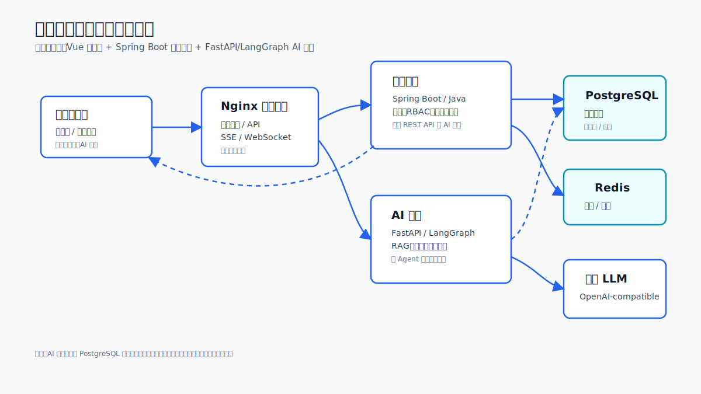

# 智慧水利防汛应急管理系统 Wiki

本 Wiki 参考 DeepWiki 的分层阅读方式组织：先给出系统全景，再进入服务、数据、接口、运行和开发细节。事实来源以仓库当前代码、README、Docker Compose、Nginx 配置、数据库迁移和现有技术文档为准。

外部参考入口：[DeepWiki - KunNode/water-info](https://deepwiki.com/KunNode/water-info)

## 快速导航

| 页面 | 适合读者 | 内容 |
| --- | --- | --- |
| [系统总览](system-overview.md) | 产品、研发、运维 | 目标、服务边界、总体链路、核心能力 |
| [架构与数据流](architecture.md) | 架构、后端、AI | 运行时拓扑、读写边界、SSE/WebSocket、容器编排 |
| [业务平台](platform-service.md) | 后端、接口调用方 | Spring Boot 模块、认证、RBAC、告警、资源、AI 代理 |
| [AI 服务](ai-service.md) | AI、后端、运维 | FastAPI、LangGraph、多 Agent、RAG、记忆、风险巡检 |
| [管理端](admin-frontend.md) | 前端、产品、测试 | Vue 路由、页面能力、状态管理、实时通信 |
| [数据模型与迁移](data-model.md) | 后端、DBA、运维 | Flyway、核心表域、迁移策略、数据一致性约定 |
| [接口与集成](api-integration.md) | 前后端、外部系统 | API 分组、代理关系、SSE 事件、WebSocket |
| [部署与运维](deployment-operations.md) | 运维、交付 | Docker Compose、环境变量、健康检查、日志、安全 |
| [开发与测试](development-testing.md) | 研发、QA | 本地启动、构建命令、测试策略、已知注意事项 |
| [决策记录](decisions-and-risks.md) | 维护者 | 关键架构取舍、风险、后续维护提醒 |

## 系统一句话

这是一个面向水利监测和防汛应急的三服务系统：

- `water-info-platform`：Java 业务平台，负责统一 REST API、认证鉴权、数据管理、告警、资源和 AI 代理。
- `water-info-ai`：Python AI 服务，负责 LangGraph 多智能体研判、RAG 知识库、会话记忆、风险评估和预案生成。
- `water-info-admin`：Vue 管理端，负责指挥仪表盘、监测管理、AI 指挥台、知识库、资源调度和系统管理。

## 推荐阅读顺序

1. 新成员先读 [系统总览](system-overview.md) 和 [架构与数据流](architecture.md)。
2. 后端维护者读 [业务平台](platform-service.md)、[数据模型与迁移](data-model.md)、[接口与集成](api-integration.md)。
3. AI 维护者读 [AI 服务](ai-service.md)、[数据模型与迁移](data-model.md)、[开发与测试](development-testing.md)。
4. 前端维护者读 [管理端](admin-frontend.md)、[接口与集成](api-integration.md)。
5. 交付和运维读 [部署与运维](deployment-operations.md)、[决策记录](decisions-and-risks.md)。
