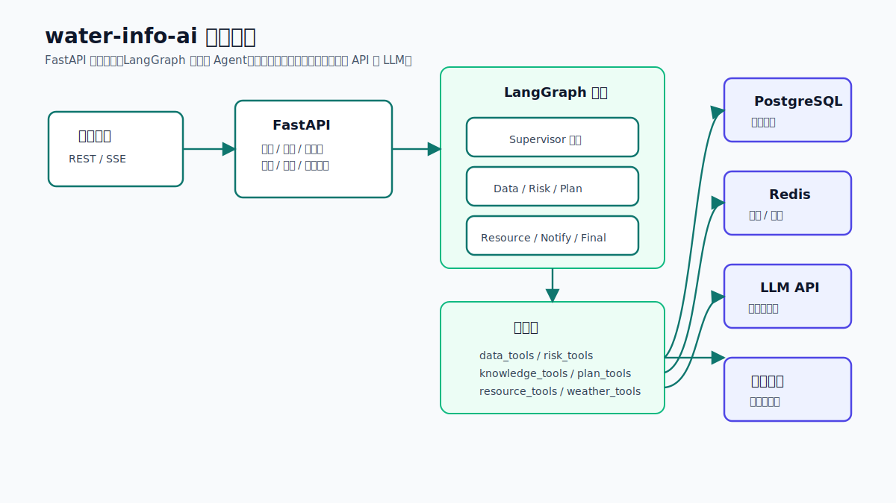
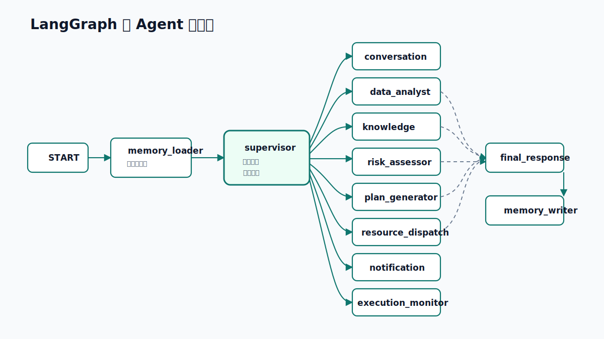
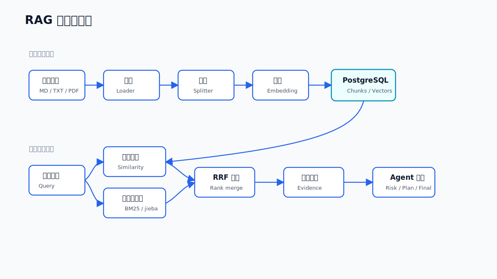

# AI 服务

`water-info-ai` 是基于 FastAPI 和 LangGraph 的防汛 AI 服务，负责把实时水情、告警、阈值、资源、知识库和 LLM 推理组织成多智能体工作流。

## 技术栈

| 类别 | 技术 |
| --- | --- |
| Runtime | Python 3.11 |
| API | FastAPI, Uvicorn |
| Workflow | LangGraph |
| DB | asyncpg, PostgreSQL |
| Memory | Redis, LangGraph PostgreSQL checkpointer/store |
| RAG | pypdf, python-docx, jieba, tiktoken, embedding API |
| LLM | OpenAI-compatible API，默认可指向 DeepSeek |
| Test/Lint | pytest, pytest-asyncio, ruff |

## LangGraph 节点

并非每轮都会经过全部节点。`supervisor` 根据用户意图、已有状态和执行结果动态选择下一步。

## 节点职责

| 节点 | 职责 |
| --- | --- |
| `memory_loader` | 加载短期会话上下文和用户长期记忆 |
| `supervisor` | 意图识别、站点聚焦、动态路由、收敛判断 |
| `conversation_assistant` | 问候、闲聊、能力说明、澄清模糊需求 |
| `data_analyst` | 查询站点、观测、阈值、告警、天气等上下文 |
| `knowledge_retriever` | 召回知识库证据 |
| `risk_assessor` | 结合实时数据和规则输出风险评估 |
| `plan_generator` | 生成结构化防汛应急预案 |
| `resource_dispatcher` | 生成物资、人员、车辆设备调度建议 |
| `notification` | 生成预警通知方案 |
| `execution_monitor` | 汇总执行进度和问题 |
| `final_response` | 组织最终回答、依据和下一步建议 |
| `memory_writer` | 提取高价值记忆并持久化 |

## 共享状态

共享状态定义在 `app/state.py`。常用字段：

- 会话：`session_id`、`user_id`、`username`、`user_query`、`messages`
- 路由：`intent`、`next_agent`、`supervisor_reasoning`、`iteration`
- 业务上下文：`focus_station`、`data_summary`、`overview_data`、`weather_forecast`
- AI 结果：`risk_assessment`、`emergency_plan`、`resource_plan`、`notifications`
- 证据与记忆：`evidence`、`evidence_context`、`memory_context`、`memory_write_result`
- 可观测性：`execution_progress`、`execution_traces`、`error`

## RAG 与记忆

知识库支持 Markdown、TXT、PDF、DOCX。流程：

记忆分为：

- 当前会话短期上下文。
- 用户长期偏好或稳定事实。
- LangGraph checkpoint/store，用于持久化图执行状态和跨会话记忆。

## 主要 API

- `GET /health`
- `POST /api/v1/flood/query`
- `POST /api/v1/flood/query/stream`
- `POST /api/v1/kb/documents`
- `POST /api/v1/kb/search`
- `GET /api/v1/plans`
- `GET /api/v1/conversations`
- `GET /api/v1/memory?session_id=...`
- `GET /api/v1/memory/user`
- `PATCH /api/v1/memory/{memory_id}`
- `DELETE /api/v1/memory/{memory_id}`
- `POST /api/v1/flood/risk-scan/trigger`

生产访问通常通过 Java 平台代理，不建议让浏览器直接面向 AI 服务。
