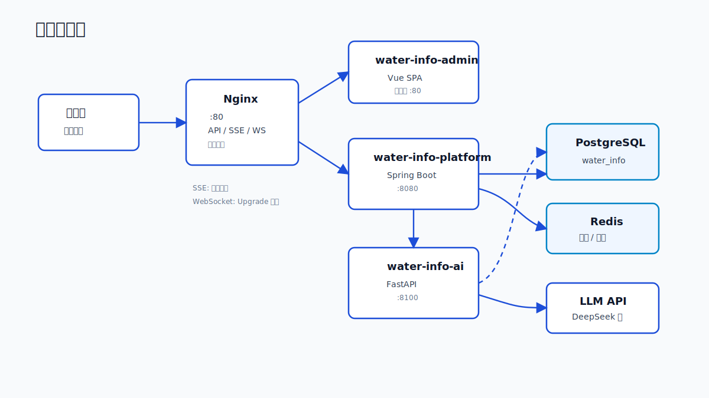
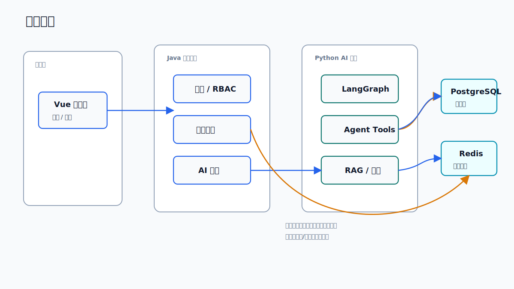

# 架构与数据流

## 运行时拓扑

## 请求路径

| 场景 | 路径 | 说明 |
| --- | --- | --- |
| 管理端访问 | `Browser -> Nginx -> admin` | 前端容器提供构建后的 SPA |
| 普通业务 API | `Browser -> Nginx -> platform` | 统一鉴权、限流、响应封装 |
| AI 非流式查询 | `Browser -> Nginx -> platform -> ai` | Java 平台代理 AI 服务，保持统一入口 |
| AI 流式查询 | `Browser -> Nginx -> platform -> ai` | Nginx 对 `/api/v1/flood/query/stream` 关闭缓冲 |
| 告警推送 | `platform -> /ws/alarms -> Browser` | WebSocket upgrade 由 Nginx 透传 |
| AI 数据读取 | `ai -> PostgreSQL` | asyncpg 直接读，降低研判延迟 |

## 读写边界

## 容器启动依赖

`docker-compose.yml` 中的主要依赖关系：

- `platform` 等待 `postgres` 和 `redis` 健康。
- `ai` 等待 `postgres` 健康，并等待 `platform` 启动。
- `nginx` 等待 `platform`、`ai` 健康，并等待 `admin` 启动。
- `admin` 依赖 `platform`，前端 API 最终由 Nginx 统一转发。

## 实时通信

- 告警推送：后端 `AlarmWebSocketHandler` 挂载在 `/ws/alarms`。
- AI 流式输出：前端通过 SSE 消费 `/api/v1/flood/query/stream`。
- Nginx 对 SSE 设置 `proxy_buffering off`、`proxy_read_timeout 600s`。
- Nginx 对 WebSocket 设置 `Upgrade` 和 `Connection: upgrade`。

## 架构维护原则

- 平台服务仍是业务边界和权限边界。
- AI 服务可以优化读路径，但不要绕过平台写入关键业务状态。
- Nginx 是生产访问入口，直接访问 `:8080` 和 `:8100` 适合开发和诊断。
- 新增跨服务能力时优先明确所有权：数据归平台，推理归 AI，交互归前端。
