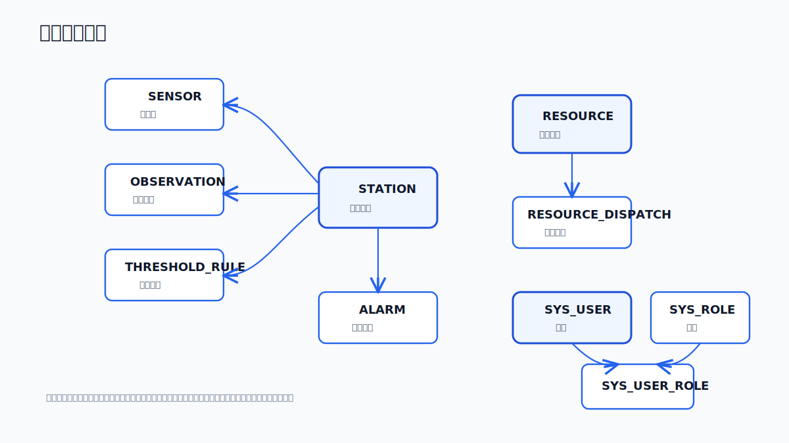

# 数据模型与迁移

## 数据库

系统使用 PostgreSQL 作为主数据库，Redis 用于缓存、会话和运行时辅助状态。Java 平台负责 Flyway 迁移，AI 服务直接读取 PostgreSQL 中的监测、告警、阈值、资源、知识库和记忆相关数据。

## Flyway 迁移

迁移目录：

```text
water-info-platform/src/main/resources/db/migration/
```

当前迁移：

| 版本 | 文件 | 说明 |
| --- | --- | --- |
| V1 | `V1__water_info_schema.sql` | 核心水利领域 schema |
| V2 | `V2__user_access_control.sql` | 用户、角色、权限 |
| V3 | `V3__legacy_public_compat.sql` | 兼容旧 public schema |
| V4 | `V4__legacy_public_seed_test_data.sql` | 演示/测试数据 |
| V5 | `V5__performance_indexes.sql` | 性能索引 |
| V7 | `V7__cuiping_lake_demo_data.sql` | 翠屏湖示例数据 |
| V8 | `V8__rag_knowledge_base.sql` | RAG 知识库表 |
| V9 | `V9__rag_embedding_dimension_fix.sql` | 嵌入维度调整 |
| V10 | `V10__scheduled_risk_monitoring.sql` | 定时风险巡检 |
| V11 | `V11__resource_management.sql` | 资源和调度 |

历史上没有 `V6`，新增迁移应使用下一个未占用版本号，不要重排旧迁移。

## 核心领域



领域分组：

- 监测域：站点、传感器、观测数据。
- 预警域：阈值规则、告警。
- 组织权限域：用户、角色、权限、组织、部门。
- 应急资源域：物资、人员、车辆设备、调度记录。
- AI 域：预案、会话、消息、知识库、记忆、研判记录、风险巡检。
- 审计域：操作日志。

## 一致性边界

| 操作类型 | 推荐路径 | 原因 |
| --- | --- | --- |
| 监测数据写入 | Java 平台 API | 统一校验、审计、权限 |
| 告警确认/关闭 | Java 平台 API | 状态机必须一致 |
| 资源调度写入 | Java 平台 API | 业务约束和库存状态 |
| AI 实时分析读 | AI 直接读 PostgreSQL | 降低研判延迟 |
| RAG 检索 | AI 直接读 PostgreSQL | 召回链路由 AI 管理 |
| 会话/记忆 | AI 服务管理，平台代理访问 | 与 LangGraph 状态绑定 |

## 迁移建议

- 新表优先明确所有权：业务平台表、AI 表或共享只读表。
- 共享读表要避免 AI 写入业务关键字段。
- 新增索引前确认查询模式，尤其是观测、告警、知识库向量/关键词检索。
- 迁移需要可重复部署，不应依赖本地环境状态。
- 生产环境不要修改已发布迁移，使用新版本迁移演进。
