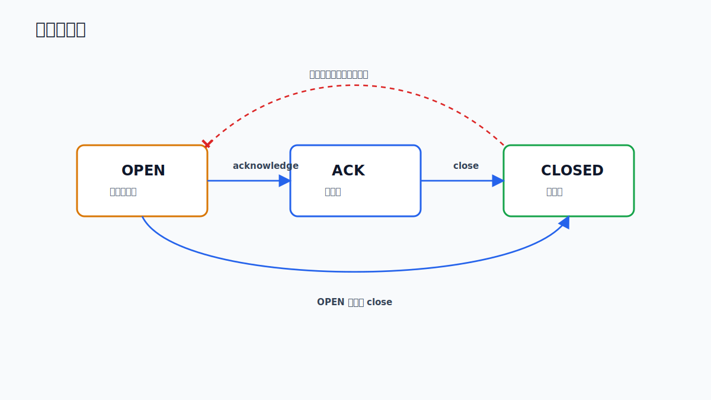

# 业务平台

`water-info-platform` 是 Spring Boot 业务服务层，负责统一 REST API、认证鉴权、领域数据、告警、资源、审计以及 AI 服务代理。

## 技术栈

| 类别 | 技术 |
| --- | --- |
| Runtime | Java 17 |
| Framework | Spring Boot 3.2.2 |
| Persistence | MyBatis-Plus 3.5.5 |
| Database | PostgreSQL |
| Migration | Flyway 10.8.1 |
| Cache | Redis, Caffeine |
| Security | Spring Security, JWT, `@PreAuthorize` |
| API docs | Springdoc OpenAPI, Swagger UI, Knife4j |
| Test | JUnit 5, Testcontainers |

## 模块结构

业务模块遵循类似分层：

```text
entity -> dto -> vo -> mapper -> service -> controller
```

| 模块 | 包路径 | 职责 |
| --- | --- | --- |
| Auth | `module/auth` | 登录、当前用户、登出 |
| User/RBAC | `module/user` | 用户、角色、组织、部门 |
| Station | `module/station` | 监测站 CRUD、类型、经纬度 |
| Sensor | `module/sensor` | 传感器状态、心跳、维护 |
| Observation | `module/observation` | 时序观测查询、批量写入、最新值 |
| Threshold | `module/threshold` | 阈值规则配置 |
| Alarm | `module/alarm` | 告警查询、确认、关闭 |
| Resource | `module/resource` | 应急资源、调度记录 |
| AI proxy | `module/ai` | AI 查询、SSE、预案、会话、知识库代理 |
| AI assessment | `module/aiassessment` | AI 研判记录持久化 |
| Audit | `module/audit` | 审计日志查询 |

## 认证与权限

登录入口：

```http
POST /api/v1/auth/login
```

前端和调用方使用返回的 JWT：

```http
Authorization: Bearer <access-token>
```

角色能力概览：

| 能力 | ADMIN | OPERATOR | VIEWER |
| --- | --- | --- | --- |
| 用户/组织/部门 | 全量 | 无 | 无 |
| 站点/传感器 | 全量 | 新增/修改/查看 | 查看 |
| 观测数据写入 | 是 | 是 | 否 |
| 阈值规则 | 全量 | 新增/修改/查看 | 查看 |
| 告警确认/关闭 | 是 | 是 | 否 |
| 资源与调度 | 全量 | 新增/修改/查看 | 查看 |
| AI 查询与预案查看 | 是 | 是 | 是 |
| 知识库上传/删除 | 是 | 否 | 否 |
| 审计日志 | 是 | 是 | 否 |

## 告警状态机



无效状态迁移由 service 层校验拒绝。

## AI 代理

`FloodAiController` 在 Java 平台暴露统一 `/api/v1` AI 入口，再由 `AiServiceClient` 调用 Python AI 服务。这样前端可以只面向一个认证、限流、响应格式统一的后端。

主要代理能力：

- `POST /api/v1/flood/query`
- `POST /api/v1/flood/query/stream`
- `GET /api/v1/plans`
- `GET /api/v1/plans/{id}`
- `POST /api/v1/plans/{id}/execute`
- `GET/POST/PATCH/DELETE /api/v1/conversations`
- `POST/GET/DELETE /api/v1/kb/documents`
- `POST /api/v1/kb/search`

## 配置入口

- `src/main/resources/application.yml`
- `src/main/resources/application-dev.yml`
- `src/main/resources/application-prod.yml`

生产环境必须覆盖：

- `ADMIN_PASSWORD`
- `JWT_SECRET`
- `SPRING_DATASOURCE_PASSWORD`
- `SPRING_DATA_REDIS_PASSWORD`
- `AI_SERVICE_URL`
