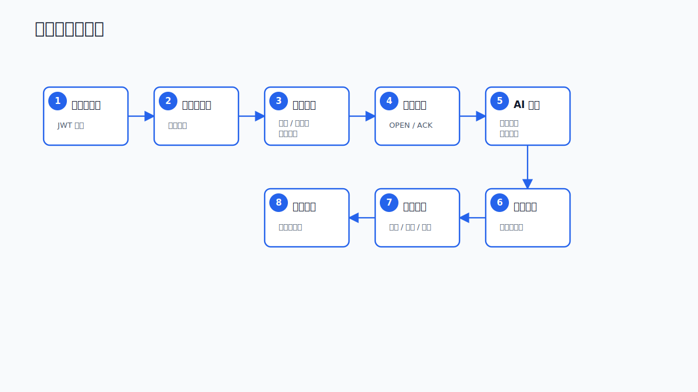

# 系统总览

## 目标

智慧水利防汛应急管理系统用于把水利监测数据、告警规则、应急资源和 AI 研判串成一个可操作闭环。系统既提供传统业务管理能力，也提供面向防汛指挥的智能问答、风险评估、预案生成和执行跟踪。

## 服务组成

| 服务 | 目录 | 技术栈 | 默认端口 | 边界 |
| --- | --- | --- | --- | --- |
| 业务平台 | `water-info-platform` | Spring Boot 3.2.2, Java 17, MyBatis-Plus | `8080` | 业务数据、认证鉴权、告警、资源、审计、AI 代理 |
| AI 服务 | `water-info-ai` | FastAPI, LangGraph, Python 3.11 | `8100` | 多 Agent 编排、RAG、会话记忆、风险巡检、预案生成 |
| 管理端 | `water-info-admin` | Vue 3, TypeScript, Vite, Element Plus | `5173` | 指挥仪表盘、监测管理、AI 指挥台、系统管理 |
| 反向代理 | `nginx.conf` | Nginx | `80` | 前端入口、API、SSE、WebSocket 转发 |
| 基础组件 | `docker-compose.yml` | PostgreSQL, Redis | `5432`, `6379` | 持久化数据、缓存、会话、LangGraph checkpoint/store |

## 核心能力

- 站点、传感器、水位、雨量、流量等监测数据管理。
- 观测数据批量写入和最新数据查询。
- 阈值规则配置和告警状态机，支持 `OPEN -> ACK -> CLOSED`。
- WebSocket 告警推送，SSE 流式 AI 响应。
- RBAC 权限控制，内置 `ADMIN`、`OPERATOR`、`VIEWER`。
- AI 指挥：数据分析、知识库检索、风险评估、预案生成、资源调度、通知建议、执行监控。
- RAG 知识库：文档上传、切块、嵌入、召回、证据引用。
- 会话历史、长期记忆、执行轨迹和定时风险巡检。

## 用户视角工作流

## 关键约定

AI 服务为了低延迟直接读取 PostgreSQL 中的监测、告警、阈值、资源和知识库数据。涉及业务规则一致性的写操作，例如预案执行、资源调度、会话代理入口等，通过 Java 平台 API 完成。
